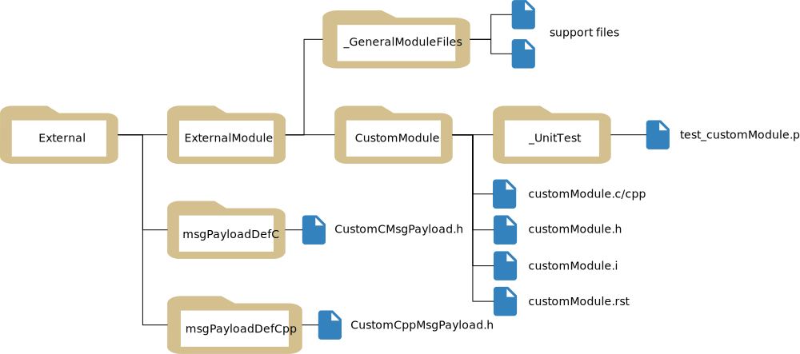

.. toctree::
   :hidden:

.. _buildExtModules:

Building Basilisk with External Modules
=======================================

The external-folder build option creates a customized Basilisk implementation
containing both core Basilisk and user-maintained modules. The custom source
stays outside the Basilisk repository, but it participates in the same CMake
build, Python package, messaging package, and native ABI as core Basilisk.

This is different from a :ref:`Basilisk Extension <bskExtensions>`. An
Extension is built and distributed independently using ``bsk-sdk``. An external
folder is an input to a from-source Basilisk build and becomes part of that
specific Basilisk installation.

Choose the Right Approach
-------------------------

.. important::

   Use :ref:`Extensions <bskExtensions>` by default for custom modules and
   messages that can be built with the interfaces exported by ``bsk-sdk``.
   Extensions are faster to rebuild, can be released independently, and can be
   installed alongside a prebuilt Basilisk wheel.

Choose an integrated external-folder build when one or more of the following
are required:

* custom code needs Basilisk headers, libraries, or implementation details not
  exported by ``bsk-sdk``;
* core and custom code must be compiled and tested with one toolchain and one
  set of Basilisk build options;
* custom messages must be included in the global
  ``Basilisk.architecture.messaging`` package;
* custom modules must be imported from ``Basilisk.ExternalModules``; or
* the deliverable must be one controlled, customized Basilisk installation or
  wheel.

The integrated build has corresponding tradeoffs:

* a Basilisk source checkout and complete native build toolchain are required;
* the custom code is coupled to the selected Basilisk checkout and build
  configuration;
* upgrading Basilisk requires rebuilding and retesting the combined product;
* custom-message changes participate in the global message build and can
  trigger broader regeneration, recompilation, and relinking; and
* the custom modules are not distributed as an independent Python package.

Both approaches execute native modules in the Basilisk process. Runtime
performance is therefore not normally a reason to prefer the integrated build
over an Extension. See :ref:`Extensions vs. Integrated External Modules
<extensions-vs-external-modules>` for a detailed comparison.

What the Build Produces
-----------------------

Given a Basilisk source checkout and one external project root, the build
system produces a single ``Basilisk`` Python package containing:

* the selected core Basilisk modules and optional components;
* custom modules under ``Basilisk.ExternalModules``;
* custom payload types under ``Basilisk.architecture.messaging``; and
* generated C message interfaces for custom C payloads.

The external source directory remains separate from the Basilisk repository.
Only the generated build output is combined. Keeping the source in its own
repository avoids local edits inside the Basilisk checkout, but the resulting
binary package is still one integrated implementation.

Prerequisites
-------------

Before continuing:

#. Clone Basilisk and prepare a source-build environment by following
   :ref:`Building from Source <bskInstall-build>`.
#. Confirm that core Basilisk builds successfully without the external folder.
#. Create or obtain an external project root with the layout described below.
#. Follow :ref:`makingModules` and the :ref:`Basilisk module checkout list
   <bskModuleCheckoutList>` when implementing and testing each module.

The external project may be stored in a separate repository and placed anywhere
that the build environment can access. An absolute path is the clearest choice
for automated builds; a relative path is resolved from the Basilisk source
directory where ``conanfile.py`` is run.

External Project Layout
-----------------------

.. sidebar:: Download the Example

   Download a sample external project containing C and C++ modules, shared
   support code, custom messages, and unit tests:
   :download:`External.zip <External.zip>`.

The external project root can have any name. The directories inside it use
fixed names because the Basilisk build discovers them automatically:

.. code-block:: text

   External/
   |-- ExternalModules/
   |   |-- CustomCppModule/
   |   |   |-- customCppModule.h
   |   |   |-- customCppModule.cpp
   |   |   |-- customCppModule.i
   |   |   `-- _UnitTest/
   |   |-- CustomCModule/
   |   |   |-- customCModule.h
   |   |   |-- customCModule.c
   |   |   |-- customCModule.i
   |   |   `-- _UnitTest/
   |   `-- _GeneralModuleFiles/
   |-- msgPayloadDefC/
   `-- msgPayloadDefCpp/

The same layout is illustrated below.

``ExternalModules``
   Required. Each child directory contains one normal Basilisk C or C++ module,
   including its SWIG interface and tests. The directory name must be exactly
   ``ExternalModules``.

``ExternalModules/_GeneralModuleFiles``
   Optional. Place C, C++, header, and SWIG support files shared by multiple
   external modules here. The files must be directly inside
   ``_GeneralModuleFiles``; nested support directories are not discovered by
   the standard build.

``msgPayloadDefC``
   Optional. Contains C-compatible payload headers named
   ``<MessageName>MsgPayload.h``.

``msgPayloadDefCpp``
   Optional. Contains C++ payload headers using the same
   ``<MessageName>MsgPayload.h`` naming convention.

All module target names and message payload names must be unique across core
Basilisk and the external project. Because this is one combined build, a name
collision is not isolated by a separate Python package namespace.

Build the Customized Basilisk
-----------------------------

Run the build from the Basilisk source root and pass the path to the external
project root, not its parent directory. For the layout above, the argument must
point to ``External``:

.. code-block:: bash

   python3 conanfile.py \
     --clean \
     --pathToExternalModules "../External"

The first build should use ``--clean`` so CMake configures the complete set of
core modules, external targets, custom messages, and optional Basilisk
components together.

The external option can be combined with normal Basilisk build options. For
example:

.. code-block:: bash

   python3 conanfile.py \
     --clean \
     --mujoco True \
     --opNav False \
     --pathToExternalModules "/absolute/path/to/External"

The resulting IDE project or command-line build contains an
``ExternalModules`` group in addition to the selected core Basilisk targets.

Verify the Build
----------------

Confirm that Python imports the customized Basilisk build rather than another
installed copy:

.. code-block:: bash

   python -c "import Basilisk; print(Basilisk.__file__)"

Import an external module and its generated messages:

.. code-block:: python

   from Basilisk.ExternalModules import customCppModule
   from Basilisk.architecture import messaging

   module = customCppModule.CustomCppModule()
   payload = messaging.CustomModuleMsgPayload()

   print(module)
   print(payload)

Run the external module tests from the Basilisk source root:

.. code-block:: bash

   python -m pytest \
     ../External/ExternalModules/CustomCppModule/_UnitTest/ \
     ../External/ExternalModules/CustomCModule/_UnitTest/ \
     -v

Run the broader Basilisk test suite before distributing the combined build.
The external code shares core libraries and messages, so module-only tests are
not sufficient release validation.

Incremental and Clean Rebuilds
------------------------------

After the initial configuration, ordinary changes to a module ``.c``, ``.cpp``,
or header file can normally use the same build command without ``--clean``.
CMake then rebuilds the affected targets:

.. code-block:: bash

   python3 conanfile.py \
     --pathToExternalModules "../External"

Use a clean rebuild after changing the external root, changing important build
options, or when generated files and build configuration may be stale:

.. code-block:: bash

   python3 conanfile.py \
     --clean \
     --pathToExternalModules "../External"

Changing a custom payload has a larger build impact than changing ordinary
module implementation code. The payload participates in the combined message
generation pipeline, and its generated bindings and C interfaces become part of
core messaging libraries. CMake rebuilds the affected generated sources,
libraries, and dependent modules. This can be substantially slower than
rebuilding an Extension-owned message, but it does not imply that every source
file is always recompiled.

Custom Messages
---------------

Place C payloads in ``msgPayloadDefC`` and C++ payloads in
``msgPayloadDefCpp``. Use normal Basilisk payload conventions and include them
from external modules through the combined source paths, for example:

.. code-block:: cpp

   #include "msgPayloadDefC/CustomModuleMsgPayload.h"

After the build, import the generated Python types from the global messaging
package:

.. code-block:: python

   from Basilisk.architecture import messaging

   payload = messaging.CustomModuleMsgPayload()
   message = messaging.CustomModuleMsg().write(payload)

Because the types enter the global package, avoid names that collide with core
Basilisk messages or other external payloads. A message rename or layout change
is an ABI change for every custom module that consumes that payload; rebuild
and retest the complete customized Basilisk package.

Shared Code and Additional Libraries
------------------------------------

Use ``ExternalModules/_GeneralModuleFiles`` for support code shared by multiple
external modules. Keep module-specific files in the module directory so the
build dependencies remain understandable.

For additional include paths, compile definitions, or third-party libraries,
an advanced external module can provide ``Custom.cmake`` in its module
directory. The build also checks for ``Custom.cmake`` associated with shared
``_GeneralModuleFiles``. Keep custom CMake changes scoped to the targets that
need them and test them on every supported platform.

Build a Customized Wheel
------------------------

To distribute one customized Basilisk wheel, pass the external-folder option
through ``CONAN_ARGS`` while building from the Basilisk source root:

.. code-block:: bash

   CONAN_ARGS="--clean --pathToExternalModules='/absolute/path/to/External'" \
     python -m pip wheel --no-deps -v .

Install and test the resulting ``bsk-*.whl`` in a clean environment before
distribution. A customized wheel uses the same ``bsk`` distribution name as
the official Basilisk package, so publish it only to a controlled internal
index or artifact store with clear provenance. Do not publish a customized
build as the official public Basilisk release.

If custom modules should instead have their own package name, wheel, version,
and release lifecycle, implement them as :ref:`Extensions <bskExtensions>`.

Update to a New Basilisk Version
--------------------------------

An external project is source-separated but build-coupled to Basilisk. When
updating Basilisk:

#. Check out the intended Basilisk tag or commit.
#. Review core API, message, compiler, and dependency changes affecting the
   external project.
#. Perform a clean integrated build with ``--pathToExternalModules``.
#. Run all external module tests and the applicable Basilisk regression tests.
#. Build and validate a new customized wheel or installation artifact.

Do not assume a previously compiled external module can be copied into a newer
Basilisk installation. Rebuild it with the selected source checkout.

Troubleshooting
---------------

``Basilisk.ExternalModules`` does not contain the module
   Confirm that ``--pathToExternalModules`` points to the root containing the
   exact ``ExternalModules`` directory. Verify that the module has a SWIG ``.i``
   file, rerun configuration, and inspect the build output for the target name.

A custom message is missing from ``Basilisk.architecture.messaging``
   Confirm that its header is directly under ``msgPayloadDefC`` or
   ``msgPayloadDefCpp`` and ends in ``MsgPayload.h``. Check for a name collision
   and perform a clean rebuild after correcting the layout.

Python imports a different Basilisk installation
   Print ``Basilisk.__file__`` and verify that the active environment points to
   the newly built package. Avoid mixing a PyPI-installed ``bsk`` with the
   integrated source build in the same environment.

A small message edit causes a large rebuild
   This is expected when generated message bindings, messaging libraries, and
   dependent modules must be rebuilt. Use an Extension if message ownership and
   fast isolated rebuilds are more important than global message integration.

The build cannot find a third-party header or library
   Add a narrowly scoped ``Custom.cmake`` for the affected module and confirm
   that the dependency is available on every target platform. Avoid modifying
   core Basilisk CMake files for project-specific dependencies.
