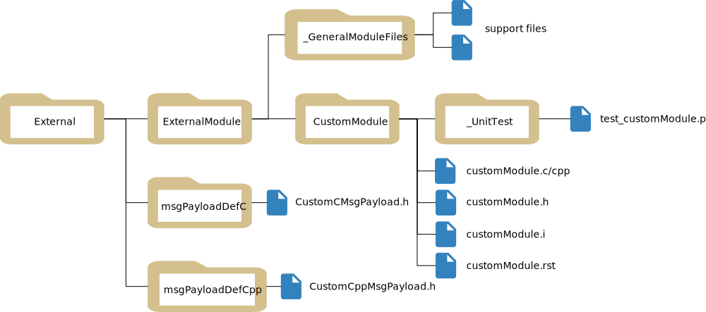

.. toctree::
   :hidden:

.. _buildExtModules:

Building Custom Modules
=======================

Motivation
----------
.. sidebar:: Source Code

    An example external folder with custom Basilisk modules and message definitions can be downloaded :download:`here </../../docs/source/Install/External.zip>`.

It is preferred that the user not put their own modules inside the official Basilisk folder unless this module is intended to be pushed back to the repository.  This keeps the official Basilisk folder free from local customizations and thus easier to keep up to date.  With Basilisk 2.0 and onwards the user has the ability to create modules which are not included in basilisk repository.  The new build system allows a single folder containing custom BSK modules to be included into a single Basilisk build. This document outlines how this is done.  The resulting build product will contain both the official Basilisk modules as well as modules available within this external folder.

.. note::

    To learn how to write Basilisk module, see the documentation at :ref:`makingModules`.  Building custom modules outside of the Basilisk source folder follows the same guidelines.

Usage
-----
To build external modules provide add this command line argument to ``python conanfile.py``::

    --pathToExternalModules <pathToYourProjectParent>

Both absolute or relative paths to the external module folder are acceptable.  Let the sample folder with custom Basilisk code be called ``External`` for the sake of this documentation.  Further, assume it is located next to the Basilisk source directory.  From the Basilisk source directory the command line build argument would be::

    python3 conanfile.py --clean --pathToExternalModules ../External

By calling the above command a project file (Xcode, MS Visual Studio or makefile) is created that integrates both the core Basilisk components as well as the modules from this external folder.  The IDE shows these under a folder called ``ExternalModules``.  The custom messages are grouped with the core BSK messages under ``architecture/msgPayloadDefC`` and ``architecture/msgPayloadDefCpp``.

Directory Structure
-------------------
The external module inclusion follows a strict directory structure resembling the existing Basilisk repository.
A single folder contains all the custom Basilisk modules and message definitions in a specific
sub-folder structure shown below.

#. ``External``:  This is the parent folder that holds all the custom Basilisk modules, support files and messages.  Note that this folder can have any name, `External` is just a sample name here.

#. ``ExternalModules``: (required, must have this name) This folder contains sub-folders for each custom Basilisk module. This folder contains the typical source code required to build and test a module.  The sub-folders have the individual module names.

#. ``ExternalModules/_GeneralModuleFiles``: (optional, but must have this name) This is useful for source code which is shared between the multiple modules. If the answer to the question “Will this code need to be included in more than one module?” is yes. Then, that support code belongs in ``_GeneralModuleFiles``. While building external modules the Basilisk build system links ``_GeneralModuleFiles`` to these external modules. The files should be located directly inside ``_GeneralModulesFiles``, no sub folders are supported in this module.

#. ``msgPayloadDefC``: (optional, must have this name) This folder contains the definition of all the custom C Message header files. The naming should follow this convention ``<Message-type>MsgPayload.h`` as discussed in :ref:`makingModules-2`.

#. ``msgPayloadDefCpp``: (optional, must have this name) This folder contains the definition of all the C++ message header files. It follows the same naming convention as C header files.

Frequently Asked Questions
--------------------------

#. Can I store my custom Basilisk folder on another drive?

    - On Linux and macOS, yes.  On Window this must be on the same drive as the Basilisk source

#. How flexible are the folder names?

    - While the primary folder, called ``External`` above, can assume any name, the key sub-folders must follow the exact naming shown above.  If you change this you must write your own ``cmake`` file.  Enjoy...

#. How do I import these custom modules when I write a Basilisk python simulation script?

    - The custom Basilisk modules are built into a ``Basilisk.ExternalModules`` package.  For example, to load a module called ``customCppModule``, use::

        from Basilisk.ExternalModules import customCppModule

