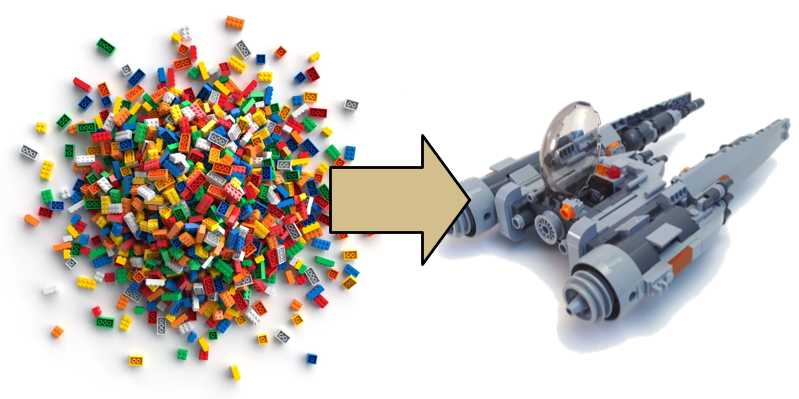
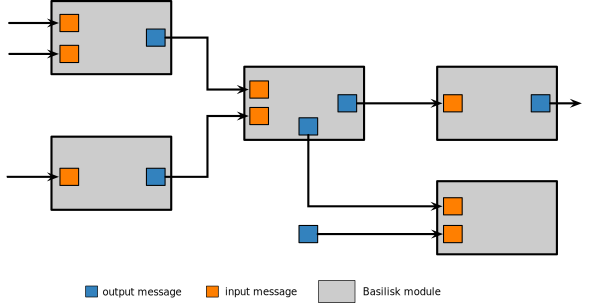

.. _bskPrinciples-0:

What is Basilisk
================

Motivation
----------
The purpose of the Basilisk astrodynamics simulation framework is to enable sophisticated spacecraft simulations to be rapidly created from a series of pre-built modules.  Consider a deep space mission where the spacecraft must perform a series of science, communication, station keeping and orbit maneuver tasks.  Such operations require not only the spacecraft orbital and attitude dynamics to be modeled, but also sub-components such as reaction wheels, thruster, flexible panels, fuel slosh.  Beyond the mechanical components the spacecraft also contains algorithms that determine the orientation, perform closed loop maneuvers, process sensor data etc.  Depending on the depth of analysis being performed, the battery, data storage or communication devices might have to be modeled.

.. sidebar:: Framework

   Why is it a framework?  Basilisk by itself is not a program that that will simulate a spacecraft.  Rather, it provides the building blocks, a software framework, with which spacecraft mission simulations are written.

The purpose of Basilisk, or BSK for short, is to provide an open-source modular spacecraft simulation environment that allows for a wide range of numerical simulations to be performed.  The atomic spacecraft behaviors and components are encapsulated into modules which have a message passing interface to interface with other components.

In essence, think of BSK providing lots of spacecraft lego blocks where the user gets to assemble them into the desired spacecraft behavior.  The benefits of this approach include:

- Reuse of spacecraft simulation code that avoid re-creating common features.
- Complex components are encapsulated into a self-contained module, allowing the user to only need to know how to use the module, not necessarily all the math contained within the module.
- Ability to exchange a particular component with another without impacting the rest of the numerical simulation.
- All BSK modules are already developed, thus the user does not have to auto-generate code and validate a particular simulation implementation.

From Modules to Spacecraft
--------------------------
The BSK modules contain a series of input and output message connections which are they key to assembling components into a functioning spacecraft simulation.  The messages provide a method to control how information is shared across the simulation.  A module may have one or more input message connections. Some input messages are optional and change the behavior of the module if they are connected.  For example, a feedback control module provides a standard control solution if the reaction wheel message is not connected, but will incorporate the reaction wheel data in the control if such a message is connected.

The content of a message is stored in the output message object.  These message objects are typically embedded within a BSK module, but can also be a stand-alone message object.  Connecting output messages to input messages connects various modules to each other, thus creating a complex spacecraft behavior from prototypical components.

Module Behavior Testing
-----------------------
How do we know that the BSK modules are doing what they are supposed to?
In each BSK module folder there is a ``_UnitTest`` folder which contains python scripts to test the functionality of the given module.  This assures that each module is working as planned.  The ``src/examples`` folder contains many integrated simulation scripts where the modules are assembled into sample spacecraft simulations.  These scripts are also tested to ensure the integrated simulation is working.  Thus, unit tests ensure a module is working individually, and integrated tests ensure that the module connections and interfaces are working properly.  As a result of this integrated testing, developing and enhancing Basilisk can be done readily while being confident that other code has not been broken.

