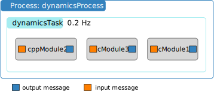

.. _bskPrinciples-2:

Adding Basilisk Modules
=======================

.. sidebar:: Source Code

    The python code shown below can be downloaded :download:`here </../../docs/source/codeSamples/bsk-2.py>`.

Understanding now what a Basilisk process (Task Group) and a task is, we can now move forward to adding Basilisk modules to a task.  :ref:`cModuleTemplate` and :ref:`cppModuleTemplate` will be the basic module C and C++ BSK modules that we use in this discussion.  These simple modules are used to illustrate how to make a prototypical Basilisk module.  The functionality and messages used are the same across both modules. These modules are convenient for this discussion as they are set up as a tutorial module and print out the module ID value when the module is executed.  This makes it simple in the simulation below to see that the desired module execution order is achieved.

The following simulation creates a single process called ``dynamicsProcess`` and single 0.2Hz task called ``dynamicsTask``. As illustrated above, two copies of :ref:`cModuleTemplate` and one of :ref:`cppModuleTemplate` are created where they are called ``cModule1``, ``cModule3`` and ``cppModule2`` respectively.  However, note that in this example we seek to execute modules 2 and 3 first and 1 last.

.. literalinclude:: ../../codeSamples/bsk-2.py
   :language: python
   :linenos:
   :lines: 18-

The resulting demonstration code is shown above.  Note that the C-based :ref:`cModuleTemplate` must be imported from ``Basilisk.fswAlgorithm`` at the top of the file.

Next we create a copy of the C-based Basilisk module.  Let's discuss this process considering a generic module name ``someCModule``.  As C code doesn't know about class objects, in Basilisk we have to recreate some of the basic features of an object oriented language like C++.  Instead of having class variables, the data of the C module is stored in the ``someCModuleConfig`` data structure.  For :ref:`cModuleTemplate` you find this module configuration structure listed at the bottom of that web page, or you can see the structure definition in the ``someCModule.h`` header file.  Thus, to create a python copy of this module configuration structure use::

    moduleData = someCModule.someCModuleConfig()

In the code example above this step is done on lines 22 and 29.

Next, for Basilisk to be able to execute this module, we need to wrap this module data structure with a C++ interface.  These steps make it possible to have multiple C module copies be created that don't conflict with each other.  The module wrapped is done with::

    moduleWrap = scSim.setModelDataWrap(moduleData)

Each Basilisk module should have a unique name.  This is set using::

    moduleWrap.ModelTag = "someModuleName"

In the code above you see these steps repeated two times to create two distinct copies of :ref:`cModuleTemplate`.  The next step is to add these modules to the task list to execute them in the desired order.  The general command to add a C-based module to a task is::

    scSim.AddModelToTask("taskName", moduleWrap, moduleData, priority)

The first argument is the name of the task to which you are adding the module.  The 2nd and 3rd arguments are the module wrapper and module data variables.  The last argument is the optional integer priority argument.

.. warning::

    If ``priority`` argument is not provided, then the priority defaults to -1 and the modules are executed in the order that they are added, but after modules with priority have been executed.  This is the same behavior as what we saw with processes and tasks earlier.

If the BSK module being added is a C++ module, then the above steps are simplified to the following.  Let the module be called ``someCppModule``.  As this is a C++ class, we don't need to create a data structure and wrap it as we do with a C module.  Rather, we can get an instance of the C++ module using::

    mod = someCppModule.SomeCppModule()
    mod.ModelTag = "moduleName"

To add this to a task use::

    scSim.AddModelToTask("taskName", mod, None, priority)

The 3rd argument is ``None`` as the module data is already contained in the module class.  To add a module without specifying the priority you can use this shorter version as well::

    scSim.AddModelToTask("taskName", mod)

In the above python script, the tutorial C++ :ref:`cppModuleTemplate` is imported from ``Basilisk.simulation``. Next, while the 1st and 3rd module are instances of the C module, the 2nd module is an instance of the equivalent C++ module.

.. note::

    Basilisk assigns unique positive ID numbers to C/C++ modules upon their creation.  Thus, in the above simulation code the modules 1, 2 and 3 will have the corresponding ID numbers 1, 2 and 3 because that is the order in which they are created.

Looking at the above simulation code, note that ``Module1`` is added to the task list without any priority specified.  In contrasts, ``Module2`` and ``Module3`` have the priorities 10 and 5 assigned.  The higher the module priority, the earlier it is evaluated.

.. note::

    The task list can contain both C and C++ based Basilisk modules at the same time.

If you execute this python code you should see the following terminal output:

.. code-block::

    source/codeSamples % python3 bsk-2.py
    BSK_INFORMATION: Variable dummy set to 0.000000 in reset.
    BSK_INFORMATION: Variable dummy set to 0.000000 in reset.
    BSK_INFORMATION: Variable dummy set to 0.000000 in reset.
    InitializeSimulation() completed...
    BSK_INFORMATION: C++ Module ID 2 ran Update at 0.000000s
    BSK_INFORMATION: C Module ID 3 ran Update at 0.000000s
    BSK_INFORMATION: C Module ID 1 ran Update at 0.000000s
    BSK_INFORMATION: C++ Module ID 2 ran Update at 5.000000s
    BSK_INFORMATION: C Module ID 3 ran Update at 5.000000s
    BSK_INFORMATION: C Module ID 1 ran Update at 5.000000s

:ref:`cModuleTemplate` and :ref:`cppModuleTemplate` log in the ``Reset()`` method that a variable has been set to 0.  As we have three such modules, notice that this reset statement is seen three times.  This reset step occurs when we run ``scSim.InitializeSimulation()``.

After the initialization, Basilisk starts the time loop evaluating the modules at the specified rate.  The ``Update()`` routine in both :ref:`cModuleTemplate` and :ref:`cppModuleTemplate` print out the module ID and the simulation time where the module is called.  Note that thanks to the module evaluation priorities we set, the desired module execution order is achieved.

.. raw:: html

    <iframe width="560" height="315" src="https://www.youtube.com/embed/JykP4zMAaBg" frameborder="0" allow="accelerometer; autoplay; clipboard-write; encrypted-media; gyroscope; picture-in-picture" allowfullscreen></iframe>
