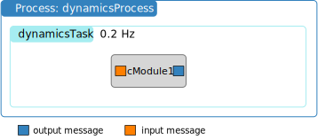

.. _bskPrinciples-2a:

Execution of Basilisk Modules
=============================

.. sidebar:: Source Code

    The python code shown below can be downloaded :download:`here </../../docs/source/codeSamples/bsk-2a.py>`.

This guide discusses the main functions that a Basilisk module must perform during setup and when running the simulation.  Each Basilisk module has 3 key methods that it must be able to perform:

``SelfInit()``:  With the C-modules this method acts as the constructor that connects the output messages to write to their own payload (i.e. message data).  This step is not required with C++ modules.

``Reset()``:  This method should reset the module variables to desired default states.  For example, this is where the integral feedback gain might be reset to 0, where module parameters like the spacecraft, reaction wheel or thruster configuration messages are read it, etc.  This method typically also does some sanity checks that the module is configured properly, and that required input messages are connected, etc.

``Update()``:  This is the primary module routine that is called every time the simulation advanced one time step.  This routine shoudl controll all the functions that this module is to perform.

The function ``scSim.InitializeSimulation()`` calls ``SelfInit()`` and ``Reset()`` for each module.  The ``Update()`` mehtod is called each task time step when the simulation is executed.

The sample script below creates a single Basilisk module as illustrated above.  The module variable ``dummy`` is set to a non-zero value after the module is created.  The ``InitializeSimulation()`` method calls ``Reset()`` which sets this ``dummy`` variable equal to zero.

.. literalinclude:: ../../codeSamples/bsk-2a.py
   :language: python
   :linenos:
   :lines: 18-

To execute the code, this script doesn't run the simulation for a period of time.  Rather, the simulation is executed for a single time step.  This is convenient in particular when testing the module input-output behavior.  The command to execute Basilisk for one time step is::

    scSim.TotalSim.SingleStepProcesses()

After the single process step execution the module ``dummy`` variable is printed out again to illustrate that an ``Update()`` call has occured.  Looking at the module source code you see that this variable is zero'd on reset and incremented by +1 on each ``Update()`` call.

If you execute this python code you should see the following terminal output:

.. code-block::

    $ python bsk-2a.py
    -10.0
    BSK_INFORMATION: Variable dummy set to 0.000000 in reset.
    0.0
    BSK_INFORMATION: C Module ID 1 ran Update at 0.000000s
    1.0

