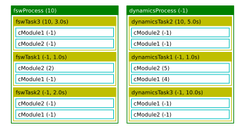

.. _bskPrinciples-2b:

Seeing the Order of Process, Task and Module Execution
======================================================

.. sidebar:: Source Code

    The python code shown below can be downloaded :download:`here </../../docs/source/codeSamples/bsk-2b.py>`.

Now that you have learned how to add and prioritize processes with task lists, as well as assign Basilisk
modules to the task for an ordered execution, it is nice to be able to see how the simulation is setup.
The :ref:`SimulationBaseClass` defines a method ``ShowExecutionOrder`` which will print to the terminal window
the process names and priorties as they are setup to be executed.  For each process you will see the order with
which the tasks will be called, and the order of task modules that will be executed.  This is very handy
to quickly validate that the simulation is setup as desired.

The sample script below creates two processes called ``dynamicsProcess`` and ``fswProcess``.  Note
that because the ``fswProcess`` has a higher priority, it is executed first even though it is added second.
The same two modules are added to a range of tasks in different orders and using different priorities.

.. literalinclude:: ../../codeSamples/bsk-2b.py
   :language: python
   :linenos:
   :lines: 18-

To execute the code, this script doesn't run the simulation itself.  Rather, the simulation is setup and
configured, and then the ``ShowExecutionOrder`` is called::

    scSim.ShowExecutionOrder()

If you execute this python code you should see the following terminal output:

.. code-block::

    $ python3 bsk-2b.py
    Process Name: fswProcess , priority: 10
    Task Name: fswTask3, priority: 10, TaskPeriod: 3.0s
    ModuleTag: cModule1, priority: -1
    ModuleTag: cModule2, priority: -1
    Task Name: fswTask1, priority: -1, TaskPeriod: 1.0s
    ModuleTag: cModule2, priority: 2
    ModuleTag: cModule1, priority: -1
    Task Name: fswTask2, priority: -1, TaskPeriod: 2.0s
    ModuleTag: cModule2, priority: -1
    ModuleTag: cModule1, priority: -1

    Process Name: dynamicsProcess , priority: -1
    Task Name: dynamicsTask2, priority: 10, TaskPeriod: 5.0s
    ModuleTag: cModule2, priority: -1
    ModuleTag: cModule1, priority: -1
    Task Name: dynamicsTask1, priority: -1, TaskPeriod: 1.0s
    ModuleTag: cModule2, priority: 5
    ModuleTag: cModule1, priority: 4
    Task Name: dynamicsTask3, priority: -1, TaskPeriod: 10.0s
    ModuleTag: cModule1, priority: -1
    ModuleTag: cModule2, priority: -1

The method ``ShowExecutionFigure(True)`` will perform the same Basilisk process, task and module order extraction process,
but display is as a figure.  The method returns a copy of the figure so it can be used in auto-documentation features
or saved off for future use.  For example, adding this command to this sample script will yields the following figure.

