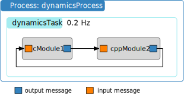

.. raw:: html

    <iframe width="560" height="315" src="https://www.youtube.com/embed/F7pcy5dkZw4" frameborder="0" allow="accelerometer; autoplay; clipboard-write; encrypted-media; gyroscope; picture-in-picture" allowfullscreen></iframe>

.. _bskPrinciples-3:

Connecting Messages
===================

.. sidebar:: Source Code

    The python code shown below can be downloaded :download:`here </../../docs/source/codeSamples/bsk-3.py>`.

So far we have learned how to add C or C++ Basilisk modules to a task, setting priorities to execute those modules, and specifying update rates; next we will look at how to connect module messages to one another. Messages are anything that a module outputs after it is executed, such as spacecraft state information, battery power, etc.  Again we use both :ref:`cModuleTemplate` and :ref:`cppModuleTemplate` as the stand-in modules to illustrate setting message connections.  Note that the input and output message connections of these modules are of the same type.  The following simulation script again uses a single process and task.  The modules are created and their input and output messages are connected as illustrated below.

The source code is shown below.  As we are going to be using the Basilisk messaging system now, it is important to import the ``messaging`` package from ``Basilisk.architecture``.  Without this the python code will not know how to subscribe to any message type, or how to create a stand-alone message.

.. literalinclude:: ../../codeSamples/bsk-3.py
   :language: python
   :linenos:
   :lines: 18-

The method ``.subscribeTo()`` connects an output message (variable name ending with ``OutMsg``) to an input message (variable name ending with ``InMsg``), as shown in lines 36-37 above.  While C modules contain message objects with a C interface, and C++ modules contain C++ message objects, the ``.subscribeTo()`` method is set up such that the user doesn't have to worry about this distinction.  Rather, this method connects C to C, C to C++, C++ to C++ and C++ to C message connections.

Thus, a module output message ``anotherModule.xxxOutMsg`` is connected to a module input message ``someModule.xxxInMsg`` using the ``.subscribeTo()`` method as follows::

    someModule.xxxInMsg.subscribeTo(anotherModule.xxxOutMsg)

The input and output message names are arbitrary.  However, the messages being connected must be of the same type.
In the above simulation code we use this protocol to connect the output message of the C module 1 to the input message of C++ module 2.  Next the output of C++ module 2 is connected to the input of C module 1 to create a sample closed-loop messaging setup.

.. warning::

    You can only subscribe an input message to an output message that already exists!  Don't try to subscribe to the message before it has been created.  In this simulation the subscriptions are all occurring after the modules are created.

If you execute this python code you should see the following terminal output:

.. code-block::

    source/codeSamples % python3 bsk-3.py
    BSK_INFORMATION: Variable dummy set to 0.000000 in reset.
    BSK_INFORMATION: Variable dummy set to 0.000000 in reset.
    BSK_INFORMATION: C Module ID 1 ran Update at 0.000000s
    BSK_INFORMATION: C++ Module ID 2 ran Update at 0.000000s
    BSK_INFORMATION: C Module ID 1 ran Update at 5.000000s
    BSK_INFORMATION: C++ Module ID 2 ran Update at 5.000000s

Note that here the two modules are added without setting a priority.  Thus, they are executed in the order that they were added to the Basilisk task.
