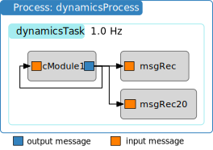

.. raw:: html

    <iframe width="560" height="315" src="https://www.youtube.com/embed/qlcV0NCEtSg" frameborder="0" allow="accelerometer; autoplay; clipboard-write; encrypted-media; gyroscope; picture-in-picture" allowfullscreen></iframe>

.. _bskPrinciples-4:

Recording Messages
==================

.. sidebar:: Source Code

    The python code shown below can be downloaded :download:`here </../../docs/source/codeSamples/bsk-4.py>`.

Great, now that we have a functioning simulation where Basilisk modules are set up with their messages connected, how do we get access to the simulation data?  This is done by creating recorder modules that will store a time history of the generated messages.

The figure above illustrates a sample Basilisk simulation.  The single test module ``cModule1`` has its output message connected to its input message.  This creates a feedback loop that will cause the output message to change.  See the module code to understand the underlying simple math.  To record the message state at various time steps, recorder modules will be created that perform this task.

.. note::

    The method of recording a message is the same, regardless if it is a C or C++ module, or the message has a C or C++ interface.

The simulation code is included below.  As the recorded message data will be plotted in this script, the ``matplotlib`` library is included at the top, as well as the helper package ``unitTestSupport`` from ``Basilisk.utilities``.

.. literalinclude:: ../../codeSamples/bsk-4.py
   :language: python
   :linenos:
   :lines: 18-

Adding a Message Recorder
-------------------------
After the single BSK module instance is created and added to the task list, new code is provided to set up the message recorders.  The general syntax is as follows.  Assume you want to record ``module.someOutMsg``.  Note that this message can be either an output or input message.  The corresponding recorder module is created using::

    someMsgRec = module.someOutMsg.recorder()
    scSim.AddModelToTask("taskName", someMsgRec)

The first line in the code block above creates the BSK message recorder object which is setup to record ``someOutMsg``.  As with any Basilisk module, it next needs to be added to a task to be executed each update cycle.  As is, the recorder is set up to record the message at the same frequency as the task list update frequency.  If you want to reduce the number of data points being recorded, you can provide an option argument::

    someMsgRec = module.someOutMsg.recorder(minUpdateTime)

Here ``minUpdateTime`` is the minimum time interval that must pass before this recorder object will record the message.

In the full script above, the recorder module ``msgRec`` is set up to record the message at the ``dynamicsTask`` update rate.  In contrast, the module ``msgRec20`` is setup to record the message only after 20s have passed.  Note that the ``minUpdateTime`` argument must be provided again in nano-seconds.

That is all that is required to set up message recording.  Next the code initializes the simulation and executes it.

Pulling the Recorded Message Data
---------------------------------
After the simulation completes, the recorded data is stored inside the ``msgRec`` and ``msgRec20`` recorders.  To access the variables of the message, simply use ``msgRec.variable`` where ``variable`` is the message structure variable you seek to access.  To access the array of time values where the message was recorded use ``msgRec.times()``.    A second time array is available that stores the times where the messages are written with ``msgRec.timesWritten()``.  Why two time arrays?  Consider an output message that is only updated every 3s, but the message is being read and recorded every second.  The ``.timesWritten()`` values will repeat until a new output message is created.

:ref:`cModuleTemplate` output message only contains the array ``dataVector``.  In this simulation it is recorded at the rate of 1Hz in ``msgRec``, and every 20s in the recorder ``msgRec20``.  The simulation creates the following plot:

.. image:: /_images/Scenarios/bsk-4.svg
   :align: center

Clearing the Message Recorder Data Log
--------------------------------------
Note that the message recorder will continuously add message data to its internal data vectors.  If you start and stop the simulation, pull the data, resume the simulation and so on, this message data recording process is cumulative.  If you stop the simulation and want to clear the message recorder data log so that only new data is recorded, you can clear the message recorder module data buffer using the ``.clear()`` method.  For example, assume a message recorder ``scRec`` has been setup and needs to be cleared, this is done with::

    scRec.clear()

Reading the Current Value of a Message
--------------------------------------
If you have a message ``msg`` and want to pull a current copy of the message data or payload, you can use
this method on both C and C++ wrapped message objects::

    msgCopy = msg.read()

