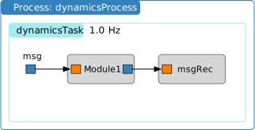

.. raw:: html

    <iframe width="560" height="315" src="https://www.youtube.com/embed/XzimNVJm8t8" frameborder="0" allow="accelerometer; autoplay; clipboard-write; encrypted-media; gyroscope; picture-in-picture" allowfullscreen></iframe>

.. _bskPrinciples-5:

Creating Stand-Alone Messages
=============================

Basics of Stand-Alone Messages
------------------------------

.. sidebar:: Source Code

    The python code shown below can be downloaded :download:`here </../../docs/source/codeSamples/bsk-5.py>`.

The prior example showed how to connect messages that are embedded within the Basilisk modules.  However, there are times where you might need to create a stand-alone copy of such a message.  Some flight algorithm modules require the input of a stand-alone message that provides information about the spacecraft mass and inertia properties, or thruster or reaction wheel configuration information.  For example, the module unit test ideally just runs the module being tested. Any input messages that this module needs should be created as stand-alone messages.  This avoids the unit test script depending on other modules output messages, but makes the module test function on its own.

This tutorial shows you how to create a stand-alone message and connect the :ref:`cppModuleTemplate` input message to it.  The syntax is identical to connect a stand-alone message to a C module.  Further, this example illustrates how the simulation can be started and stopped multiple times while the message or module variables are changed between runs.

To create a stand-alone message, the message payload (i.e. data) container must be created first.  Let us assume the message is of type ``someMsg``.  The corresponding payload is called ``someMsgPayload``.  Thus, the payload container is created using::

    msgData = messaging.someMsgPayload()

Essentially this is a python instance of the message structure definition found in ``architecture/msgPayloadDefC/SomeMsg.h``.  The content of the message payload is zero'd on creating it.  If there is a ``variable`` in the structure that we want to change, this is done simply with::

    msgData.variable = .....

Next, a message object is created and the message data is written to it.  The message object is created using::

    msg = messaging.someMsg()

The payload is written to the message using::

    msg.write(msgData)

These steps can also be combined into a single line using::

    msg = messaging.someMsg().write(msgData)

The simulation code below creates a stand-alone message that is then connected to the module input message.

.. literalinclude:: ../../codeSamples/bsk-5.py
   :language: python
   :linenos:
   :lines: 18-

After the simulation runs for 10s, the stand-alone message data is changed and written into the message object.  Note that the stand-alone message object itself doesn't have to be re-created as this is still working and connected to the desired modules.  Rather, we only have to update the content of the message.

Next, the simulation stop time is extended for an additional 10s to 20s total and the simulation is executed again.  The resulting plot of the module output message is shown below.

.. image:: /_images/Scenarios/bsk-5.svg
   :align: center

Retaining Message Objects in Memory
-----------------------------------

When creating stand-alone message objects in Python, it's crucial to understand that these objects must be retained in memory to function properly. If a message object is created locally within a function or method and not stored in a persistent variable, Python's garbage collector may remove it from memory once the function exits, even if C++ components still need to access it.

This is particularly important when:

1. Creating message objects in subroutines or helper functions
2. Dynamically generating messages based on runtime conditions
3. Setting up message interfaces that will be used throughout simulation

**Example: Using a Class-Level Registry to Retain Objects**

A common pattern in Basilisk to ensure message objects remain in memory is to use a
class-level registry or list that persists for the lifetime of your simulation.
Here's how this is implemented in Basilisk's own code:

.. code-block:: python

    class BskSimulation:
        def __init__(self):
            # Create class-level registry if it doesn't exist
            if not hasattr(self, '_message_registry'):
                self._message_registry = []

        def setup_sensors(self):
            """Set up sensor messages and devices."""

            # Create a message
            sensor_msg = messaging.SensorMsg()

            # Store message in class-level registry to prevent garbage collection
            self._message_registry.append(sensor_msg)

            # Create the sensor module that will use this message
            self.sensor_module = sensorModule.SensorModule()
            self.sensor_module.sensorOutMsg.subscribeTo(sensor_msg)

            return

This pattern is used in Basilisk's own implementation for components like Coarse
Sun Sensors (CSS):

.. code-block:: python

    def SetCSSConstellation(self):
        """Set the CSS sensors"""
        self.CSSConstellationObject.ModelTag = "cssConstellation"

        # Create class-level registry if it doesn't exist
        if not hasattr(self, '_css_registry'):
            self._css_registry = []

        def setupCSS(cssDevice):
            cssDevice = coarseSunSensor.CoarseSunSensor()
            cssDevice.fov = 80. * mc.D2R
            cssDevice.scaleFactor = 2.0
            cssDevice.sunInMsg.subscribeTo(self.gravFactory.spiceObject.planetStateOutMsgs[self.sun])
            cssDevice.stateInMsg.subscribeTo(self.scObject.scStateOutMsg)
            # Store CSS in class-level registry to prevent garbage collection
            self._css_registry.append(cssDevice)

        # Create CSS devices and add them to the registry...

**Alternative Approach: Using a Dictionary Registry**

For more complex simulations where you need to retrieve specific messages later,
you can use a dictionary-based registry:

.. code-block:: python

    class BskSimulation:
        """A registry to keep message objects alive in Python memory."""

        def __init__(self):
            self.messages = {}

        def make_message(self, name):
            """Make a message object with a unique name."""
            msg_obj = messaging.SensorMsg()
            self.messages[name] = msg_obj
            return msg_obj

        def get_message(self, name):
            """Retrieve a message object by name."""
            return self.messages.get(name)

**Have Parent Method Retain the Msg Object in memory**

If the message setup method returns in instance of the message, then the parent method
could be responsible for retaining this message object in memory

.. code-block:: python

    class BskSimulation:
        """A registry to keep message objects alive in Python memory."""

        def make_message(self):
            """Make a message object and return it."""
            msg = messaging.SensorMsg()
            msg.fov = 2.0
            return msg

        def parent_method(self, name):
            """Retrieve a message object by name."""
            self.sensorMsg = self.make_message()
            return

**Common Pitfalls**

Without proper retention, you might encounter issues like:

- Messages that appear to be properly connected but don't transmit data
- Simulation components that can't communicate as expected
- Mysterious segmentation faults or access violations in C++ code

By using a registry pattern or ensuring message objects are stored in long-lived
variables, you can avoid these issues and create more modular, maintainable
simulation code.
