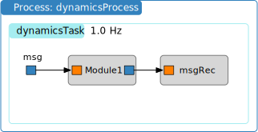

.. youtube:: XzimNVJm8t8
   :width: 560
   :height: 315

.. _bskPrinciples-5:

Creating Stand-Alone Messages
=============================

Basics of Stand-Alone Messages
------------------------------

.. sidebar:: Source Code

    The python code shown below can be downloaded :download:`here </../../docs/source/codeSamples/bsk-5.py>`.

The prior example showed how to connect messages that are embedded within the Basilisk modules.  However, there are times where you might need to create a stand-alone copy of such a message.  Some flight algorithm modules require the input of a stand-alone message that provides information about the spacecraft mass and inertia properties, or thruster or reaction wheel configuration information.  For example, the module unit test ideally just runs the module being tested. Any input messages that this module needs should be created as stand-alone messages.  This avoids the unit test script depending on other modules output messages, but makes the module test function on its own.

This tutorial shows you how to create a stand-alone message and connect the :ref:`cppModuleTemplate` input message to it.  The syntax is identical to connect a stand-alone message to a C module.  Further, this example illustrates how the simulation can be started and stopped multiple times while the message or module variables are changed between runs.

To create a stand-alone message, the message payload (i.e. data) container must be created first.  Let us assume the message is of type ``someMsg``.  The corresponding payload is called ``someMsgPayload``.  Thus, the payload container is created using::

    msgData = messaging.someMsgPayload()

Essentially this is a python instance of the message structure definition found in ``architecture/msgPayloadDefC/SomeMsg.h``.  The content of the message payload is zero'd on creating it.  If there is a ``variable`` in the structure that we want to change, this is done simply with::

    msgData.variable = .....

You may also initalize fields on construction::

    msgData = messaging.someMsgPayload(variable=...)

Next, a message object is created and the message data is written to it.  The message object is created using::

    msg = messaging.someMsg()

The payload is written to the message using::

    msg.write(msgData)

These steps can also be combined into a single line using::

    msg = messaging.someMsg().write(msgData)

The simulation code below creates a stand-alone message that is then connected to the module input message.

.. literalinclude:: ../../codeSamples/bsk-5.py
   :language: python
   :linenos:
   :lines: 18-

After the simulation runs for 10s, the stand-alone message data is changed and written into the message object.  Note that the stand-alone message object itself doesn't have to be re-created as this is still working and connected to the desired modules.  Rather, we only have to update the content of the message.

Next, the simulation stop time is extended for an additional 10s to 20s total and the simulation is executed again.  The resulting plot of the module output message is shown below.

.. image:: /_images/Scenarios/bsk-5.svg
   :align: center

Retaining Message Objects in Memory
-----------------------------------

Before Basilisk 2.12, a stand-alone message created inside a Python helper had to
be stored in a persistent variable. Otherwise, Python could garbage-collect the
message after the helper returned while a module still held pointers to its data.

Starting with Basilisk 2.12, object-based message subscriptions automatically
retain their source for the lifetime of the subscription. A stand-alone message
may therefore leave Python scope safely while an input message remains subscribed
to it. This applies whether the input reader is embedded in a C or C++ module. For
an embedded ``Msg_C`` source in a wrapped C module or C-module config, Basilisk
retains the owning object rather than the temporary Python message proxy.

Message recorders follow the same lifetime rule. A recorder created from a
stand-alone C or C++ message retains that source until the recorder is released.
A recorder created from an embedded ``Msg_C`` source retains the C-module wrapper
or config that owns the message storage.

For example, this helper does not need to return or otherwise retain ``inputMsg``:

.. code-block:: python

    def connectInput(module):
        """Create and connect a stand-alone input message."""
        payload = messaging.CModuleTemplateMsgPayload(dataVector=[1.0, 2.0, 3.0])
        inputMsg = messaging.CModuleTemplateMsg().write(payload)
        module.dataInMsg.subscribeTo(inputMsg)

Keeping an explicit Python reference remains valid and can make ownership clearer.
It is also useful when the caller needs to write new data, inspect the message,
unsubscribe and reconnect it, or otherwise access it later:

.. code-block:: python

    class BskSimulation:
        def __init__(self):
            self.inputMsg = messaging.CModuleTemplateMsg()

        def connectInput(self, module, payload):
            """Write and connect the retained input message."""
            self.inputMsg.write(payload)
            module.dataInMsg.subscribeTo(self.inputMsg)

The automatic lifetime guarantee has the following boundaries:

* Calling ``unsubscribe()`` releases the subscription's reference. Retain the
  message explicitly if it must be available for a later reconnection.
* Subscribing by a raw integer address is caller-owned and does not retain a
  Python source object.
* This guarantee applies to message sources connected through ``subscribeTo()``.
  Modules, sensors, effectors, and other wrapped simulation objects can have
  separate ownership requirements and may still need persistent Python references.
