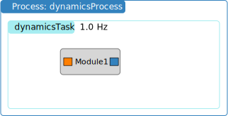

.. _bskPrinciples-6:

Setting and Recording Module Variables
======================================

.. sidebar:: Source Code

    The python code shown below can be downloaded :download:`here </../../docs/source/codeSamples/bsk-6.py>`.

Sometimes it is convenient to record a Basilisk module variable, not just the input or output message.  This can be done via a python command as shown below.  However, note that such module variable recording will slow down the simulation as this is done in the python layer.  

The simulation setup is shown in the figure below.  Both a C and C++ module are created and added to the single task.  However, no messages are connected here.  Rather, this sample code illustrates how to record module internal variables.  The variables are either public C++ class variables, or they are variables with the C module configuration structure.  Both :ref:`cModuleTemplate` and :ref:`cppModuleTemplate` have the exact same public variables for easy comparison.

The sample code is shown below.  The C and C++ modules are set up as before.  The variable ``someVariable`` of module ``someModule`` is set in python using ``someModule.someVariable = ...``.

.. literalinclude:: ../../codeSamples/bsk-6.py
   :language: python
   :linenos:
   :lines: 18-

Logging a variable from a module is similar to recording one from a message::

    moduleLogger = module.logger(variableName, recordingTime)

The ``variableName`` must be either a string or a list of strings. This establishes what module variables to log.

The optional ``recordingTime`` variable is the minimum time that must pass, in nano-seconds again,
before the module variable is recorded.  If this variable is not provided, then the logging occurs
at the module update period.

After executing the script, the recorded variables are retrieved using ``moduleLogger.variableName`` 
where ``variableName`` is the the name of the module variable you seek to access. 

To access the array of time values where the module variables were recorded use ``moduleLogger.times()``. 
Note that these times are given in nanoseconds.

Executing the script you should thus see the following output:

.. code-block::

    source/codeSamples % python bsk-6.py
    BSK_INFORMATION: Variable dummy set to 0.000000 in reset.
    BSK_INFORMATION: Variable dummy set to 0.000000 in reset.
    BSK_INFORMATION: C Module ID 1 ran Update at 0.000000s
    BSK_INFORMATION: C++ Module ID 2 ran Update at 0.000000s
    BSK_INFORMATION: C Module ID 1 ran Update at 1.000000s
    BSK_INFORMATION: C++ Module ID 2 ran Update at 1.000000s
    Times:  [         0 1000000000]
    mod1.dummy:
    [1. 2.]
    mod2.dummy:
    [1. 2.]
    mod2.dumVector:
    [[1. 2. 3.]
    [1. 2. 3.]]

Note that both the C and C++ module variables are correctly being recorded.

Clearing the Data Log
---------------------
Similarly to message recorders, module loggers continuously add data to their internal data vectors. 
If you start and stop the simulation, pull the data, resume the simulation and so on, 
this data recording process is cumulative. If you stop the simulation and want to clear the data log 
so that only new data is recorded, you can clear the logger using the ``.clear()`` method::

    moduleLogger.clear()

Advanced Data Logging
---------------------
The syntax ``module.logger(variableName)`` generates a simple logger for one or more module variables.
However, loggers can retrieve data from many other sources, and do arbitrary operations on this data
before it is stored. This is done using the class ``Basilisk.utilities.pythonVariableLogger``.
See :ref:`scenarioFuelSlosh` for an example.
