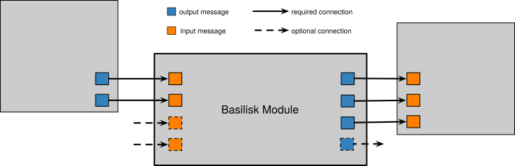
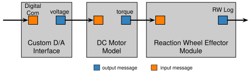
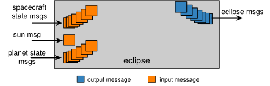

.. _makingModules-1:

Module Design Considerations
============================

The basic Basilisk module encapsulates some mathematical behavior of a spacecraft or the space environment.
Information is passed through the message passing interface using message objects.  Message objects contain the
message data and provide an output connection for an input message reader object.  The input message reader object
can retrieve the data from the output message object and return a copy of the data structure.  These are commonly
called output and input message objects, respectively.

Message Connections
-------------------
The illustration above shows how a module can contain multiple input and output messages.  While some messages
might be required for the module to properly function, other messages might be optional.  For example, consider :ref:`mrpFeedback`.  The module has optional input messages that read in the reaction wheel states and configuration parameters.  If these are provided, then the control mathematics includes their information.  If they are not connected, then the module behavior simplifies to an attitude feedback control without reaction wheel devices.

One Big Module or Several Small Modules
---------------------------------------
As is typical with modular software, the question always arises on how large, or how small, should a module function be?  The design goal should be flexibility and re-use of the modules.  Think of all the math that goes into a module.  Is this math only going to be used together as a unit? Or, could part of that math be used in conjunction with other modules as well.  In the latter case it is recommended to break up the math into multiple modules.

For example, consider :ref:`reactionWheelStateEffector`.  This module's input message contains an array of motor
torques.  However, some reaction wheel (RW) devices have an analog or digital interface.  This functionality is
intentionally not included in :ref:`reactionWheelStateEffector`, so the RW physics and control interface can be exchanged
independently if needed.  As illustrated above, the RW physics is contained in one module, separate from two other
modules that contain the RW digital interface and motor torque behavior.  With this setup, the Basilisk simulation
can directly drive the RWs with commanded motor torque, or the simulation fidelity can be increased by including the
motor behavior and/or the digital control interface.

Variable Number of Input or Output Messages
-------------------------------------------
In some cases it makes sense to write the module such that it can handle a variable number of input and/or output messages.  For C++ modules these are in the form of a ``std::vector`` of messages, or in C modules as an array of message objects.  With C modules these arrays should be written as a fixed length array to avoid dynamic memory allocation.  The C++ standard vector format has the advantage that an arbitrary number of messages can be added.

Consider :ref:`eclipse`.  The module has one input message that provides the Sun location.  However, instead of
handling eclipses for only one planet at a time, the module is set up to consider multiple planets.  A simulation can
therefore model a spacecraft that starts in orbit around Earth, leaves the Earth system, and arrives at Mars.  By
considering eclipses caused by both Earth and Mars, the same simulation can handle both objects.

When writing a module with variable number of messages extra considerations should be taken.  As a planet state input message is added to the eclipse module, the module also needs to increase the private vector of planet state message buffers.  This is why this module does not have the user set the vector of planet input messages directly from python, but rather a module method called ``addPlanetToModel()`` is used.  This method both controls the standard vector of input messages and private buffer message copies.

Further, this module is written to not only provide an eclipse output message for a single spacecraft, but rather a multitude of spacecraft can be considered.  This avoids the user having to create eclipse modules for each spacecraft in the simulation, and add the planets to these modules.  A lot of computation would be repeated in such a solution.  Rather, by having the module read in the vector of planet messages and a vector of spacecraft messages much math can be combined.  For this module an eclipse output message must be created for each spacecraft.  Again this is a reason why the user does not set the vector of spacecraft state input messages directly, but rather a helper method is employed.  In this case the ``addSpacecraftToModel()`` method

- receives a spacecraft state message
- adds it to the vector of input message
- expands the private vector of spacecraft state input buffer variables
- creates the corresponding spacecraft eclipse output message

To see how a C module handles a variable number of messages, see :ref:`navAggregate`.
