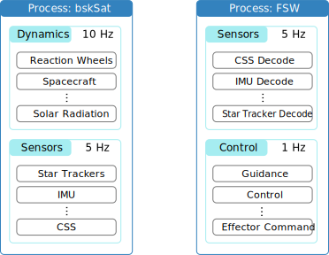

Basilisk Process and Task Creation
==================================

.. sidebar:: Source Code

    The python code shown below can be downloaded :download:`here </../../docs/source/codeSamples/bsk-1.py>`.

To execute modules within the simulation, their evaluation is controlled through the Basilisk ``Process`` and ``Task`` features.  The BSK ``Task`` contains a series of modules which are all executed with the same update rate.  A ``Process`` is essentially a task group which can contain several related tasks.  For example, in a multi-satellite simulation you could create a ``Process`` for each satellite to keep the associated tasks and embedded modules organized. The illustration below shows a sample layout where the dynamics of ``bskSat`` satellite is added to a separate process from the flight software (FSW) algorithms being executed on this satellite.  Within each process there are several tasks set up which are evaluated at specified rates.  The dynamics process contains a ``Dynamics`` task to evaluate the spacecraft translational and rotational motion, as well as a ``Sensors`` task to create sensor output messages.

The python code example below illustrates a prototypical BSK simulation setup.  The ``Process`` and ``Task`` creation are controlled through the utility package ``SimulationBaseClass``.  This is loaded to provide the core Basilisk task creation capability.  The ``macros`` utility is loaded to provide some convenient helper functions.

Next, a method ``run()`` is created that will execute the BSK simulation.  The name of this method is arbitrary.  The core Basilisk simulation framework ``scSim`` is created as an instance of ``SimBaseClass()``.  Now a process is created using the ``CreateNewProcess(name)`` method where ``name`` is a string containing the process name.

.. literalinclude:: ../../codeSamples/bsk-1.py
   :language: python
   :linenos:
   :lines: 18-

The next step is the creation of three BSK processes: two processes for dynamics, and one process for FSW.  Note that the process order of execution is determined here by the order in that they are created.  There is an optional priority argument that can be provided to over-ride this execution order using::

    dynProcess = scSim.CreateNewProcess("name", priority)

The integer priority defaults to -1 which means that this process is executed after all processes with a specified priority, and in the order that the non-priority processes were created.

The next steps create task lists that are contained in a process or task group.  The first argument is the string name that identifies the task being created.  The second argument is the task update rate in nano-seconds.  Here the ``macros.sec2nano()`` method is a convenient tool to convert seconds to nano-seconds.  When the BSK simulation increments its time variable, it does so in nano-second time steps, the smallest time unit in Basilisk.  It is chosen to be small enough such that no dynamics, sensor or algorithm module should require a smaller time step.  However, it is still large such that with a 64-bit unsigned integer we can still simulated a mission lifetime of 584 years.  .. I thought this line was a little extra.

As with the ``Process`` creation, the ``Task`` creation by default has a priority of -1. This means that the task lists are evaluated after any prioritized task lists within the process and in the order they are created.  To set a positive priority value to a task use::

    dynProcess.addTask(scSim.CreateNewTask("name", updateRate, priority))

To execute processes and tasks, call the ``InitializeSimulation()`` method which initializes the simulation module ``scSim`` and the modules within it.

Next, the simulation length is set through ``ConfigureStopTime(stopTime)`` where again the stop time must be provided in nano-seconds.  Note that this is the absolute stop time.  If you run the simulation for 5 seconds, then change some parameters, and then want to resume the simulation for an additional 5 seconds, the second stop time must be the accumulated simulation time of 10 seconds. .. I don't understand this. What do you mean by "resume" the simulation? Maybe I'm not understanding something more fundamental here.

** Tutorial Review Video **

.. raw:: html

    <iframe width="560" height="315" src="https://www.youtube.com/embed/6YmZyu0f-qI" frameborder="0" allow="accelerometer; autoplay; clipboard-write; encrypted-media; gyroscope; picture-in-picture" allowfullscreen></iframe>
