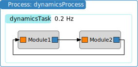

Connecting Messages
===================

.. sidebar:: Source Code

    The python code shown below can be downloaded :download:`here </../../docs/source/codeSamples/bsk-3.py>`.

Having learned how to add C or C++ Basilisk modules to a task and setting priorities, next we will look at how to connect the module messages.  Again we use :ref:`fswModuleTemplate` as the stand-in module to illustrate setting message connections.  Note that the input and output message connections of this module are of the same type.  The the following simulation script again a single process and task are setup.  The modules are created and their input and output messages are connected as illustrated below.

The source code is shown below.  As we are going to be using the Basilisk messaging system now, it is important to import the ``messing`` package from ``Basilisk.architecture``.  Without this the python code will not know how to subscribe to any message type, or how to create a stand-alone message.

.. literalinclude:: ../../codeSamples/bsk-3.py
   :language: python
   :linenos:
   :lines: 18-

The method connect an input message (variable name ending with ``InMsg``) to an output message (varible name ending with ``OutMsg``) is the ``.subscribeTo()`` method.  While C modules contain message objects with a C interface, and C++ modules contain C++ message objects, the ``.subscribeTo()`` method is setup such that the user doesn't have to worry about this distinction.  Rather, this method connect C-C, C-C++, C++-C++ and C++-C message connections.

Thus, given a module input message ``someModule.xxxInMsg`` and a module output message ``anotherModule.xxxOutMsg``, these are connected using::

    someModule.xxxInMsg.subscribeTo(anotherModule.xxxOutMsg)

In the above simulation code we use this protocol to connect the output message of module 1 to the input message of module 2.  Next the output of module 2 is connected to the input of module 1 to create a sample closed-loop messaging setup.

.. note::

    You can only subscribe an input message to an output message that already exists!  Don't try to subscribe to the message before it has been created.  In this simulation the subscriptions are all occuring after the modules are created.

If you execute this python code you should see the following terminal output:

.. code-block::

    source/codeSamples % python3 bsk-3.py
    BSK_INFORMATION: Variable dummy set to 0.000000 in reset.
    BSK_INFORMATION: Variable dummy set to 0.000000 in reset.
    BSK_INFORMATION: Module ID 1 ran Update at 0.000000s
    BSK_INFORMATION: Module ID 2 ran Update at 0.000000s
    BSK_INFORMATION: Module ID 1 ran Update at 5.000000s
    BSK_INFORMATION: Module ID 2 ran Update at 5.000000s

Note that here the 2 modules are added without setting a priority.  Thus, they are executed in the order that they were added to the Basilisk task.

.. ** Tutorial Review Video **

    .. raw:: html

        <iframe width="560" height="315" src="https://www.youtube.com/embed/6YmZyu0f-qI" frameborder="0" allow="accelerometer; autoplay; clipboard-write; encrypted-media; gyroscope; picture-in-picture" allowfullscreen></iframe>
