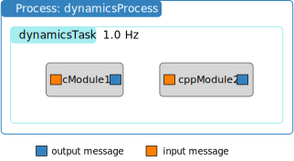

Redirecting Module Output C-wrapped Message
===========================================

.. sidebar:: Source Code

    The python code shown below can be downloaded :download:`here </../../docs/source/codeSamples/bsk-6.py>`.

The prior example showed how to connect messages that are embedded within the Basilisk modules.  However, there are times where you might need to create a stand-alone copy of such a message.  Some flight algorithm modules require the input of a stand-alone messages the provides information about the spacecraft mass and inertia properties, or thruster or reaction wheel configuration information.  Further, the module unit test ideally just run the module being tested and all input messages are well-controlled stand-alone messages.

This tutorial shows you how to create a stand-alone message and connect the :ref:`fswModuleTemplate` input message to it.  Further, this example illustrates how the simulation can be started and stopped multiple times while the message or module variables are changed between runs.

text

.. literalinclude:: ../../codeSamples/bsk-6.py
   :language: python
   :linenos:
   :lines: 18-

.. ** Tutorial Review Video **

    .. raw:: html

        <iframe width="560" height="315" src="https://www.youtube.com/embed/6YmZyu0f-qI" frameborder="0" allow="accelerometer; autoplay; clipboard-write; encrypted-media; gyroscope; picture-in-picture" allowfullscreen></iframe>
