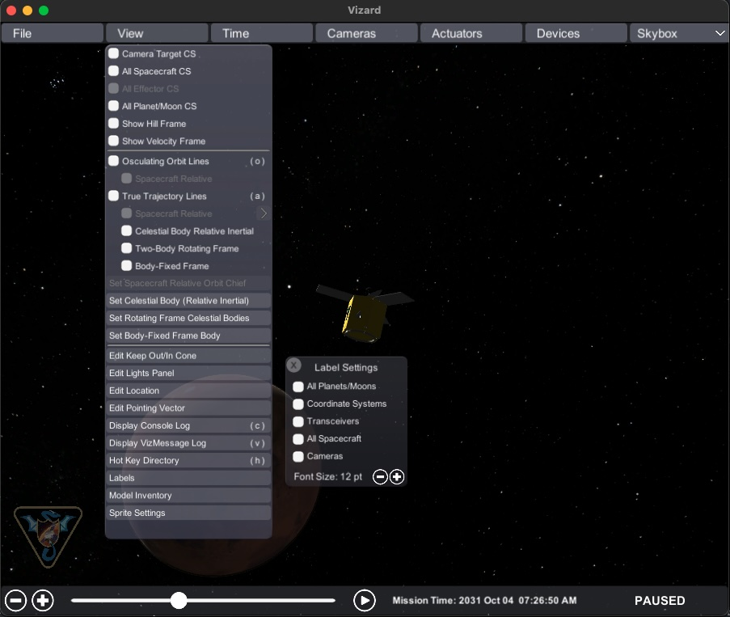
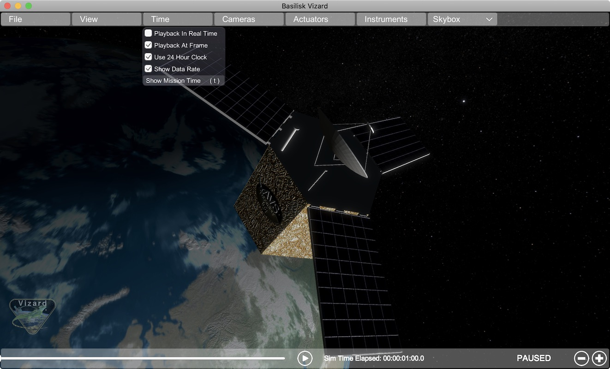

.. toctree::
   :maxdepth: 1
   :hidden:

.. _vizardGUI:

User Guide
==========

.. image:: /_images/static/basiliskVizardLogo.png
       :align: right
       :scale: 50 %

Startup Panel
-------------

When starting up the Vizard software a panel is presented where the user can select which simulation to visualize. To play back a previously recorded BSK simulation press the `Select` button and navigate to the binary BSK recording file. After a file has been selected press the `Start Visualization` button.

.. image:: ../_images/static/vizard-img2.jpg
   :align: center
   :width: 90 %

To live stream data from a running Basilisk simulation to Vizard, refer to the :ref:`vizardLiveComm` page.

View Modes
----------
To engage with the visualization, the
view point can be rotated and the user can zoom in and out. There are
three view modes available:

-  **Spacecraft-Centric View Mode** (default): Here the spacecraft is
   drawn 1:1 while showing other celestial objects about it. When
   rotating the center of the spacecraft is the center of rotation. The
   spacecraft trajectory is not shown in this view. You can zoom in and
   out locally, but if you zoom out too far then the view mode switched
   to a planet-centric view mode.
-  **Planet-Centric View Mode**: Here a planet-wide view is presented.
   When rotating the view point this is about with the center of the
   planet as the center of rotation. The spacecraft trajectory is shown.
   The spacecraft is drawn at an exaggerated size so it is visible as a
   3D object in this view. To return to a spacecraft-centric view mode
   double click on the spacecraft. If you zoom out far enough then the
   mode switches to a heliocentric view.
-  **Heliocentric View Mode**: Here a solar system wide view is shown.
   The planets are drawn enlarged to make them visible, and the planet
   trajectories are shown as well. If the spacecraft is orbiting a
   planet it is not visible in this view. If the spacecraft is on a
   heliocentric trajectory it is shown, also enlarged, in this view.
   Double clicking on a planet returns the user to a planet-centric
   view.

Space Vehicle States
--------------------
The following sections describe
the basic user interface elements of Vizard. Some settings can be set
via a Basilisk script as described in the :ref:`vizardSettings`.

Basic Position and Orientation
^^^^^^^^^^^^^^^^^^^^^^^^^^^^^^

Vizard is able to show the position and orientation of the spacecraft
being simulated. If one or more planets are being modeled, then the
spacecraft is show relative to the nearest planet.

Reaction Wheel States
^^^^^^^^^^^^^^^^^^^^^

If Reaction Wheels or RWs are modeled, then a RW panel can be opened
from within the ``Actuator`` menu bar item. Here the RW wheel speeds and
motor torques are shown.

.. image:: ../_images/static/vizard-ImgRW.jpg
   :align: center
   :width: 90 %

Thruster States
^^^^^^^^^^^^^^^
If thrusters are being simulated then a range of visualizations can be
enables within the ``Actuator`` menu item. The options include to open
a Thruster Panel which shows the thruster firings as bar charts. The
thruster HUD uses a particle engine to illustrate if a thruster is
firing. Here the length and density of the particles is related to the
strength and duty cycle of the thruster. The thruster geometry option
draws small cones where the thrusters are modeled to be. This is
useful when debugging that a thruster configuration is being properly
modeled. Finally, the thruster normals option illustrates the thrust
axes being modeled.

``File`` Menu Item
------------------

Settings Panel
^^^^^^^^^^^^^^
This panel provides access to some system defaults:

- ambient brightness
- keyboard controlled camera angular rate
- keyboard controlled camera zoom rate

Save Messages To File
^^^^^^^^^^^^^^^^^^^^^
Allows all the protobuffer message, or a sub-set, to be saved off to a file.  This document is located
inside a sub-folder ``VizardData`` inside the user's home directory.

``View`` Menu Item
------------------
The ``View`` menu tab contains a range of Vizard options. A range of coordinate frames can be toggled on or off.

.. image:: ../_images/static/vizard-imgAxes.jpg
   :align: center
   :width: 90 %

Edit Pointing Vector
^^^^^^^^^^^^^^^^^^^^
This allows a line to be drawn from the spacecraft aimed at another
celestial body such as the sun, a planet, etc. The spacecraft location
is referred to as “Inertial”. The purpose of these lines is to have a
quick visual reference in what direction another body is located. The
lines can be hidden or removed as needed. Some celestial bodies come
with default colors such as yellow for sun heading, or red for Mars
heading, etc. However, each line color can be customized as needed.

.. image:: ../_images/static/vizard-ImgPointing.jpg
   :align: center
   :width: 90 %

Edit Keep Out/In Cone
^^^^^^^^^^^^^^^^^^^^^
This feature allows for a cone to be added relative to the spacecraft
which indicates if a cone about a particular body-fixed axis intersects
with a celestial object. For example, this can be used to add a cone to
validate that the sensor axis doesn't get too close to the sun (keep out
cone), or if the solar panel normal axis stays within some cone to the
sun (keep in cone). If the cone in/out condition is not triggered, then
the cone is opaque. If the in/out condition is triggered, then the cone
becomes solid.

.. image:: ../_images/static/vizard-ImgCones.jpg
   :align: center
   :width: 90 %

Edit Location
^^^^^^^^^^^^^
Here you can control what ground or satellite locations are shown, as well as toggle if the location
boresight vector should be shown, or/and the location coverage cone.  These locations can also be scripted
in python.  However, this panel allows for locations to be added or edited on the fly.

Display VizMessage Log
^^^^^^^^^^^^^^^^^^^^^^
This opens up a panel which displays all the raw protobuffer message states.  You can downselect
what type of messages to how with toggles on the left side.  The messages are updated in realtime
as the simulation progresses.  Note, if a message is sent only once on start-up, it is only shown
on the first simulation frame.  This panel is useful when debugging protobuffer communication features.

Adjust GUI Scale
^^^^^^^^^^^^^^^^^
This brings up a panel where a global GUI scale factor can be set.  This is useful increase or decrease,
the Vizard font, panel and GUI element sizes.  The Vizard default values switch automatically with the screen
resolution.  If a specific value is set in this panel than this over-rides the auto-setting.

Model Inventory Panel
^^^^^^^^^^^^^^^^^^^^^
If you want to see to the Vizard space object model inventory panel, then select ``View/Model Inventory`` as illustrated in the
following image:

.. image:: ../_images/static/vizard-ImgCAD-6.jpg
   :align: center
   :width: 90 %

Hot-Key Directory
^^^^^^^^^^^^^^^^^
The key ``h`` will open up a help panel showing all the hot-keys that are available.  This includes a
camera-centric flashlight model with ``L``, or ways to engage constant camera rates, or stopping all
camera rates with ``s``, etc.

Labels
^^^^^^
This allows you to turn on labels for spacecraft, planets, even actuators such as thrusters etc.

Model Inventory
^^^^^^^^^^^^^^^
Brings up a panel to edit and modify the 3D CAD models that are used by a spacecraft or a planet.

``Time`` Menu Item
------------------
The ``Time`` menu tab contains a range of Vizard time or mission date related option. Some of these items have
a keyboard short-cut assigned.

- **Playback in Real time:** This mode syncs up the playback speed to be real time where 1s of simulation time takes
  1s of real time.  This can be increased or decreased as desired.
- **Playback at Frame:** This mode plays back each data frame as it arrives.  Thus, the visualization is playing
  back a data file as fast as it can without skipping any data frames.  If you press the Plus icon then the data
  playback speed is doubled to 2 by only showing every second frame.  Pressing Plus again doubles once more the data
  rate to 4 to showing only
  every 4th data frame.  If you press negative the trend is reversed.  You can slow down the playback as well in this
  mode in that a data rate of 1/2 means a data frame is held for 2 unit cycles.
- **Use 24 Hour Clock:** This toggles between a 12 hour clock using `am` and `pm` and a 24 hour clock.
- **Show Mission/Sim Time:** This toggles the time bar to show either the simulation elapsed time or the mission
  date and time.  Note that if the Basilisk simulation doesn't set an epoch date than January 1st, 2019, 00:00am
  is assumed by the simulation.
- **Show Data Rate**: This toggle shows the data frame rate.  If this is 1, then every data rate is being shown.
  If the rate is 2, then only every 2nd data frame is shown.  A data rate of 1/2 means a frame is held for
  one rendering cycle to slow down the simulation.
- **Show FPS**: This toggles on the frames-per-second on the lower right of the screen

``Camera`` Menu Item
--------------------
The Camera menu item allows for custom camera views to be created into
the visualization. The first item called *Changed Main Camera Target* brings up a list of simulation objects that
can be made the focus of the simulation camera window.  This makes it easy to switch between an Earth-centric and a
spacecraft centric simulation point of view.

Note that the ``Camera`` menu list contains 2 default camera options that can be turned on.  Selecting either camera
1 or camera 2 will open a stand-alone camera view as shown below.  Finally, if more camera views are required,
these can be added with the *Add Camera* menu option. Within a camera panel the user can
select from which object the camera is
simulated, and where this camera is pointing.  Below the camera is selected to point camera along a body fixed vector.

.. image:: ../_images/static/vizard-imgCamera1.jpg
   :align: center
   :width: 90 %

In this second illustration the camera is chosen to point toward another simulation object such as the Earth.
Here the user can select to point the camera at the target (nadir), along the velocity direction (along-track)
or orbit-normal,.

.. image:: ../_images/static/vizard-imgCamera2.jpg
   :align: center
   :width: 90 %

If you press the snap shot icon on the lower right of the camera panel, then the camera view is captured and stored
as a PNG image within the user's home directory.

Import a Custom Shape Model
---------------------------
When Vizard starts up it represents the spacecraft using a default CAD model called ``bsk-Sat``.  The following section illustrates how this default spacecraft model can be replaced with with a custom CAD model in an ``.obj`` file format, or by using a built-in shape primitive.

.. image:: ../_images/static/vizard-ImgCAD-1.jpg
   :align: center
   :width: 90 %

Vizard starts up showing a default spacecraft shape.  To select a different shape, a custom CAD model can be imported using the OBJ file format.  Go to the ``File`` menu and select ``Import OBJ Model``:

.. image:: ../_images/static/vizard-ImgCAD-2.jpg
   :align: center
   :width: 90 %

Next, select the OBJ file that is to be imported into Vizard.

.. image:: ../_images/static/vizard-ImgCAD-3.jpg
   :align: center
   :width: 90 %

The next panel allows the CAD model import to be customized.  The user can modify the origin offset,
the CAD orientation and the CAD scaling.  The latter is useful to convert the CAD model into meters
used by Vizard.  The model center and model extrema information is provided as a convenient.  A
bounding box can also be draw as a convenient to make sure this is correctly configured.  Note that
if a model is to be applied for each simulation instance, then see how ``createCustomModel()`` can be
configured to script this OBJ import process as illustrated in :ref:`vizardSettings`.

.. image:: ../_images/static/vizard-ImgCAD-4.jpg
   :align: center
   :width: 90 %

At this point a panel appears that allows you select the object for which you want to apply a new
shape, and what shape you want to apply.  When ready, press `Apply Models to Selected Objects` to
apply the custom space object shape.  Note that instead of an OBJ file a custom shape can also be
selected such as a sphere, cylinder or cube.

.. image:: ../_images/static/vizard-ImgCAD-5.jpg
   :align: center
   :width: 90 %

Built-In CAD Models of Celestial Bodies
---------------------------------------

While custom CAD shapes can be imported to display celestial bodies and spacecraft shapes,
Vizard has several built-in models that are automatically applied if the body has the
corresponding name.  For the gravitational bodies, :ref:`vizInterface` uses by default
the string ``planetName`` in the ``GravBodyData()`` structure as the gravity body label.  If
the optional string ``displayName`` is set, this this gravity body label over-rides the ``planetName``
string.  This is handy in that sometimes the gravity body might have an unintuitive Spice ID or name,
and the user wishes to label the planet with a more common name such as ``earth``, ``mars``, etc.
Further, or override the auto-shape selection and specify a specific shape, use the
``modelDictionaryKey`` string to specify CAD model to be used.  This allows the CAD keyword and the
planet label to be different.

This gravity body label is used in Vizard to select a default shape.  For example, Vizard seeks
for the label ``earth`` (regardless of capitalization) and will find it in ``earth``, ``earth_planet_data``, etc.
The following table is the list of built-in Vizard celestial bodies.

.. list-table:: Build-In Vizard Celestial Body Shapes
    :widths: 25 25 50
    :header-rows: 1

    * - Vizard Keyword
      - Features
      - Satellites
    * - Mercury
      -
      -
    * - Venus
      - atmospheric shader
      -
    * - Earth
      - atmospheric shader
      - moon
    * - Mars
      - atmospheric shader
      - Phobos, Deimos
    * - Jupiter
      -
      -
    * - Saturn
      -
      -
    * - Uranus
      -
      -
    * - Neptune
      -
      -
    * - Bennu
      -
      -
    * - Ryugu
      -
      -

Advanced Options
----------------

``File/Compress Messages`` Option
^^^^^^^^^^^^^^^^^^^^^^^^^^^^^^^^^

This option will compress the number of stored vizMessages from the current run. This feature is especially useful during multi-day live streaming simulation runs when the number of saved :ref:`vizInterface` can grow too large for the app to continue running.

Selecting this option brings up a settings panel that allows the user to specify how many messages should be retained. For example, if the user opts to retain 1/2  stored messages, Vizard will delete every other message in the :ref:`vizInterface` dictionary, reducing the Vizard memory footprint.

.. warning::

   Compression can be applied when running the Vizard from a :ref:`vizInterface` archive file *or* when live streaming. Please note that the compression cannot be reversed, but that the archive file, if in use, will not be changed.

Sprite Representation of Space Objects
^^^^^^^^^^^^^^^^^^^^^^^^^^^^^^^^^^^^^^
Vizard is setup to show an attitude dependent 3D rendering of a spacecraft model by default.  In a planet centric
or helio-centric view the spacecraft is enlarged such that the orientation can still be determined.  This is the
default behavior if a single satellite is shown.  However, if multiple satellites are shown then seeing enlarged
3D renderings can both be a large computation hit and confusing to the viewer.  Thus, if 2 or more spacecraft are shown,
and the view point is planet- or sun-centric, then Vizard defaults to showing the spacecraft locations as 2D sprites.

The default shape is a white circle.  Using ``View/Sprite Settings`` opens a control panel to custumize the use
of sprites.  Different shape primitives and colors can be selected for some or all the spacecraft and planets.  Further,
toggles are provided to over-ride the default behavior and switch between a 3D rendering or 2D sprite representation.

