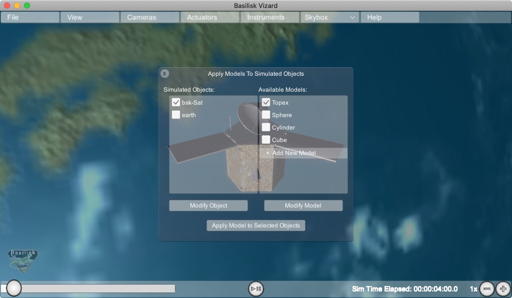
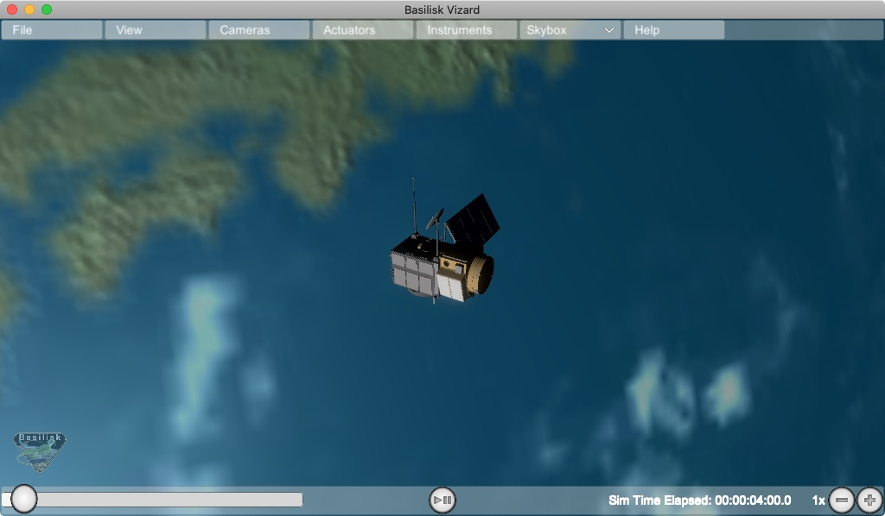

.. toctree::
   :maxdepth: 1
   :hidden:

.. _vizardGUI:

User Guide
==========

Startup Panel
-------------

hen starting up the Vizard software the user is presented with a resolution and graphics setting option panel as shown above. There is an option on the lower portion of this panel to turn off this plane on start-up and only show it if the program is started while pressing the option key. Note that the Vizard screen size can be dynamically changed after startup as well.

.. image:: ../_images/static/vizard-img0.jpg
   :align: center
   :scale: 50 %
	
Next Vizard presents a panel where the user can select which simulation to visualize. To play back a previously recorded BSK simulation press the `Select` button and navigate to the binary BSK recording file. After a file has been selected press the `Start Visualization` button.

.. image:: ../_images/static/vizard-img2.jpg
   :align: center
   :width: 90 %

To live stream data from a running Basilisk simulation to Vizard make sure that the connection type is `DirectComm` and the mode is `Live Streaming`.  When starting a Basilisk script that uses live streaming (see :ref:`scenarioBasicOrbitStream`) the socket address, such as ``tcp://localhost:5556``, is shown in the terminal window. Copy this and paste it into the Vizard socket address text field. Finally press the `Start Visualization` button to begin the visualization.

View Modes 
----------
To engage with the visualization, the
view point can be rotated and the user can zoom in and out. There are
three view modes available:

-  **Spacecraft-Centric View Mode** (default): Here the spacecraft is
   drawn 1:1 while showing other celestial objects about it. When
   rotating the center of the spacecraft is the center of rotation. The
   spacecraft trajectory is not shown in this view. You can zoom in and
   out locally, but if you zoom out too far then the view mode switched
   to a planet-centric view mode.
-  **Planet-Centric View Mode**: Here a planet-wide view is presented.
   When rotating the view point this is about with the center of the
   planet as the center of rotation. The spacecraft trajectory is shown.
   The spacecraft is drawn at an exaggerated size so it is visible as a
   3D object in this view. To return to a spacecraft-centric view mode
   double click on the spacecraft. If you zoom out far enough then the
   mode switches to a heliocentric view.
-  **Heliocentric View Mode**: Here a solar system wide view is shown.
   The planets are drawn enlarged to make them visible, and the planet
   trajectories are shown as well. If the spacecraft is orbiting a
   planet it is not visible in this view. If the spacecraft is on a
   heliocentric trajectory it is shown, also enlarged, in this view.
   Double clicking on a planet returns the user to a planet-centric
   view.

Space Vehicle States 
--------------------
The following sections describe
the basic user interface elements of Vizard. Some settings can be set
via a Basilisk script as described in the :ref:`vizardSettings`.

Basic Position and Orientation
^^^^^^^^^^^^^^^^^^^^^^^^^^^^^^

Vizard is able to show the position and orientation of the spacecraft
being simulated. If one or more planets are being modeled, then the
spacecraft is show relative to the nearest planet.

Reaction Wheel States
^^^^^^^^^^^^^^^^^^^^^

If Reaction Wheels or RWs are modeled, then a RW panel can be opened
from within the ``Actuator`` menu bar item. Here the RW wheel speeds and
motor torques are shown. 

.. image:: ../_images/static/vizard-ImgRW.jpg
   :align: center
   :width: 90 %

Thruster States
^^^^^^^^^^^^^^^
If thrusters are being simulated then a range of visualizations can be
enables within the ``Actuator`` menu item. The options include to open
a Thruster Panel which shows the thruster firings as bar charts. The
thruster HUD uses a particle engine to illustrate if a thruster is
firing. Here the length and density of the particles is related to the
strength and duty cycle of the thruster. The thruster geometry option
draws small cones where the thrusters are modeled to be. This is
useful when debugging that a thruster configuration is being properly
modeled. Finally, the thruster normals option illustrates the thrust
axes being modeled.

.. image:: ../_images/static/vizard-ImgTHR.jpg
   :align: center
   :width: 90 %

Vizard Configuration Options
----------------------------

``View`` Menu Item
^^^^^^^^^^^^^^^^^^
The ``View`` menu tab contains a range of Vizard options. A range of coordinate frames can be toggled on or off.

Add Pointing Vector
^^^^^^^^^^^^^^^^^^^
This allows a line to be drawn from the spacecraft aimed at another
celestial body such as the sun, a planet, etc. The spacecraft location
is referred to as “Inertial”. The purpose of these lines is to have a
quick visual reference in what direction another body is located. The
lines can be hidden or removed as needed. Some celestial bodies come
with default colors such as yellow for sun heading, or red for Mars
heading, etc. However, each line color can be customized as needed.

Add Keep Out/In Cone
^^^^^^^^^^^^^^^^^^^^
This feature allows for a cone to be added relative to the spacecraft
which indicates if a cone about a particular body-fixed axis intersects
with a celestial object. For example, this can be used to add a cone to
validate that the sensor axis doesn't get too close to the sun (keep out
cone), or if the solar panel normal axis stays within some cone to the
sun (keep in cone). If the cone in/out condition is not triggered, then
the cone is opaque. If the in/out condition is triggered, then the cone
becomes solid. 

Adjust Brightness
^^^^^^^^^^^^^^^^^
This option allows the user to increase or decrease the ambient lighting of the Vizard Simulation.

Model Inventory Panel
^^^^^^^^^^^^^^^^^^^^^
If you want to see to the Vizard space object model inventory panel, then select ``View/Model Inventory`` as illustrated in the
following image:

	
``Camera`` Menu Item
--------------------
The Camera menu item allows for custom camera views to be created into
the visualization. The first item called *Changed Main Camera Target* brings up a list of simulation objects that
can be made the focus of the simulation camera window.  This makes it easy to switch between an Earth-centric and a
spacecraft centric simulation point of view.

Note that the ``Camera`` menu list contains 2 default camera options that can be turned on.  Selecting either camera
1 or camera 2 will open a stand-alone camera view as shown below.  Finally, if more camera views are required,
these can be added with the *Add Camera* menu option. Within a camera panel the user can
select from which object the camera is
simulated, and where this camera is pointing.  Below the camera is selected to point camera along a body fixed vector.

.. image:: ../_images/static/vizard-imgCamera1.jpg
   :align: center
   :width: 90 %

In this second illustration the camera is chosen to point toward another simulation object such as the Earth.
Here the user can select to point the camera at the target (nadir), along the velocity direction (along-track)
or orbit-normal,.

.. image:: ../_images/static/vizard-imgCamera2.jpg
   :align: center
   :width: 90 %

If you press the snap shot icon on the lower right of the camera panel, then the camera view is captured and stored
as a PNG image within the user's home directory.

Import a Custom Shape Model
---------------------------
When Vizard starts up it represents the spacecraft using a default CAD model called ``bsk-Sat``.  The following section illustrates how this default spacecraft model can be replaced with with a custom CAD model in an ``.obj`` file format, or by using a built-in shape primitive.

.. image:: ../_images/static/vizard-ImgCAD-1.jpg
   :align: center
   :width: 90 %

Vizard starts up showing a default spacecraft shape.  To select a different shape, a custom CAD model can be imported using the OBJ file format.  Go to the ``File`` menu and select ``Import OBJ Model``:

.. image:: ../_images/static/vizard-ImgCAD-2.jpg
   :align: center
   :width: 90 %

Next, select the OBJ file that is to be imported into Vizard.

.. image:: ../_images/static/vizard-ImgCAD-3.jpg
   :align: center
   :width: 90 %

The next panel allows the CAD model import to be customized.  The user can modify the origin offset,
the CAD orientation and the CAD scaling.  The latter is useful to convert the CAD model into meters
used by Vizard.  The model center and model extrema information is provided as a convenient.  A
bounding box can also be draw as a convenient to make sure this is correctly configured.  Note that
if a model is to be applied for each simulation instance, then see how ``createCustomModel()`` can be
configured to script this OBJ import process as illustrated in :ref:`vizardSettings`.

At this point a panel appears that allows you select the object for which you want to apply a new
shape, and what shape you want to apply.  When ready, press `Apply Models to Selected Objects` to
apply the custom space object shape.  Note that instead of an OBJ file a custom shape can also be
selected such as a sphere, cylinder or cube.

Advanced Options
----------------

``File/Compress Messages`` Option
^^^^^^^^^^^^^^^^^^^^^^^^^^^^^^^^^

This option will compress the number of stored vizMessages from the current run. This feature is especially useful during multi-day live streaming simulation runs when the number of saved vizMessages can grow too large for the app to continue running.

Selecting this option brings up a settings panel that allows the user to specify how many messages should be retained. For example, if the user opts to retain 1/2  stored messages, Vizard will delete every other message in the vizMessage dictionary, reducing the Vizard memory footprint.

.. warning::

   Compression can be applied when running the Vizard from a vizMessage archive file *or* when live streaming. Please note that the compression cannot be reversed, but that the archive file, if in use, will not be changed.