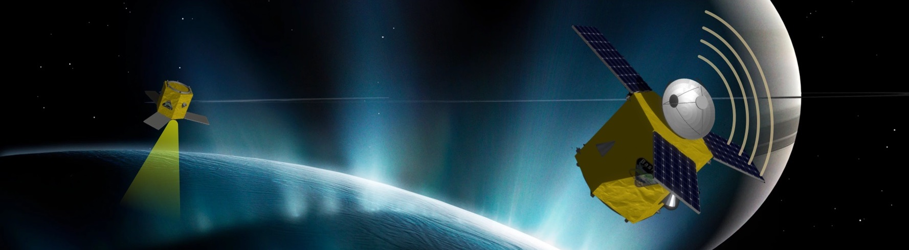
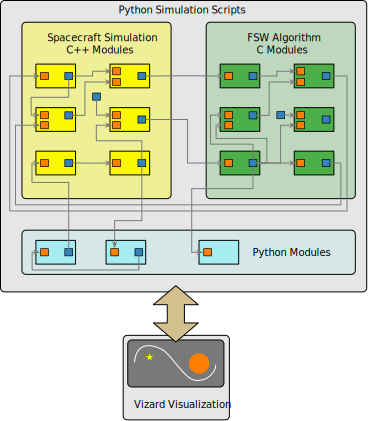

.. _aboutBSK:

Welcome to Basilisk: an Astrodynamics Simulation Framework
==========================================================

Architecture
------------

.. sidebar:: Basilisk Info

    .. image:: _images/static/Basilisk-Logo.svg
       :align: center
       :width: 300

    **Description:** Basilisk is a fast, open source, spacecraft-centric mission simulation framework

    **License:** `ISC Open Source
    License  <https://en.wikipedia.org/wiki/ISC_license>`__

    **Platforms:** macOS, Linux and Windows

    **Status:** |version|

    **Logo:** :download:`PNG <_images/static/Basilisk-Logo.png>`
    :download:`PDF <_images/static/Basilisk-Logo.pdf>`
    :download:`SVG <_images/static/Basilisk-Logo.svg>`

Basilisk, or BSK for short, is a software framework
capable of both faster-than realtime spacecraft simulations, including repeatable
Monte-Carlo simulation options, as well as providing real-time options
for hardware-in-the-loop simulations. The Basilisk package is designed
as a set of Python modules written in C/C++ which allows for the ease of
scripting and reconfigurability of Python while still providing the
execution speed of C/C++. The software is being developed jointly by the
University of Colorado `AVS
Lab <http://hanspeterschaub.info/AVSlab.html>`__ and the `Laboratory for
Atmospheric and Space Physics <http://lasp.colorado.edu/home/>`__
(LASP). The resulting framework is targeted for both astrodynamics
research modeling the orbit and attitue of complex spacecraft systems,
as well as sophisticated mission-specific vehicle simulations that
include hardware-in-the-loop scenarios.

A companion Visualization program is called :ref:`Vizard <vizard>`.  This stand-alone program is based on the Unity rendering engine and can display the Basilisk simulation states in an interactive manner.

What is Basilisk Used For?
--------------------------
This software is being actively used for:

- astrodynamics research to model complex spacecraft dynamical behaviors
- developing new guidance, estimation and control solutions
- supporting mission concept development
- supporting flight software development
- supporting hardware in the loop testing by simulating in realtime the spacecraft states
- analysis of flight data and compare against expected behavior
- supporting spacecraft AI based autonomy development

Name/Logo Description
----------------------

The name Basilisk was chosen to reflect both the reptilian (Python)
nature of the product-design as well as a nod to the speed requirements
as the South American common basilisk runs so fast that it can even run
across water.

.. sidebar:: Basilisk Users and Customers

    - Startup Space Companies
    - Academic Researcher Groups
    - Autonomous Vehicle Systems Lab
    - Spaceflight Algorithm Designers
    - Space Mission Analysts and Contractors
    - International Researchers and Organizations
    - Mission Developers

Basilisk Design Goals
----------------------

The Basilisk framework is being designed from inception to support
several different (often competing) requirements.

-  **Speed:** Even though the system is operated through a Python
   interface, the underlying simulation executes entirely in C/C++ which
   allows for maximum execution speed. For example, a goal is to
   simulate a mission year with sufficiently accurate vehicle 6-DOF
   dynamics with at least a 365x speed-up (i.e. *a year in a day*).

-  **Reconfiguration:** The user interface executes natively in Python
   which allows the user to change task-rates, model/algorithm
   parameters, and output options dynamically on the fly.

-  **Analysis:** Python-standard analysis products like
   `numpy <http://www.numpy.org>`__ and
   `matplotlib <http://matplotlib.org>`__ are actively used to
   facilitate rapid and complex analysis of data obtained in a
   simulation run without having to stop and export to an external tool.
   This capability also applies to the Monte-Carlo engine available
   natively in the Basilisk framework.

-  **Hardware-in-the-Loop:** Basilisk will provide synchronization to
   realtime via software-based clock tracking modules. This allows the
   package to synchronize itself to one or more timing frames in order
   to provide deterministic behavior in a realtime environment.

-  **Scriptability:** The Python user interface to the C/C++ layer
   relies on the `Simplified Wrapper and Interface
   Generator <http://swig.org>`__ (SWIG) software, a cross-platform,
   open-source software tasked solely with interfacing C/C++ with
   scripting languages. This Python layer allows the simulation to be
   easily reconfigured which allows the user complete freedom in
   creating their own simulation modules and flight software (FSW)
   algorithm modules. Further, the Python layer abstracts
   logging/analysis which allows a single compilation of the source code
   to support completely different simulations.

.. sidebar:: Basilisk Impact and Value

    - Research repeatability and extensibility
    - Rapid development
    - Open source access
    - Rapid development and integrated V&V
    - Integrated systems modeling via a well-defined API
    - Speed

-  **Controlled Data Flow:** Simulation modules and FSW algorithm
   modules communicate through the message passing interface (MPI),
   which is a singleton pattern. The MPI allows data traceability and
   ease of test. Modules are limited in their ability to subscribe to
   messages and write messages, thus setting limitations on the flow of
   information and the power of modules to control data generation. The
   messaging system is also instrumented to track data exchange,
   allowing the user to visualize exactly what data movement occurred in
   a given simulation run.

-  **Cross-Platform Solution:** Basilisk is inherently cross-platform in
   nature, and is supported on macOS, Windows, and Linux systems. The
   Python layer, C programming language, ZeroMQ communication library
   and Unity visualization are active cross-platform developments.

-  **Validation and Verification:** Each simulation or FSW algorithm
   module has unit test that can be run automatically using ``pytest``.
   Integrated scenario test validated coupled behavior between modules.
   Each dynamics modules has associated momentum, energy and power
   validation tests. This ensures the integrity of the validated modules
   as new simulation capabilities are added.

-  **Monte-Carlo Capability:** The simulation framework is capable of
   doing bit-for-bit repeatable Monte-Carlo runs. The simulation
   parameters can be disturbed through a range of distribution
   functions.

-  **3D Visualization:** Basilisk has an accompanying stand-alone
   visualization called
   `Vizard  <https://hanspeterschaub.info/bskHtml/vizard.html>`__ that
   uses `Unity  <https://unity.com>`__ to visualize the spacecraft, its
   orientation and orbits, the local planets, and various qualitative
   data and indicators for sensors and actuators. Simulation events and
   device faults may be triggered directly from the visualization.

Related Publications
--------------------

- J. Alcorn, H. Schaub, S. Piggott, "`Attitude Control Performance Analysis Using Discretized Thruster With Residual Tracking  <https://hanspeterschaub.info/Papers/Alcorn2016.pdf>`_", AAS GN&C Conference, Breckenridge, Colorado, February 5--10, 2016.
- C. Allard, H. Schaub, and S. Piggott, "`General Hinged Solar Panel Dynamics Approximating First-Order Spacecraft Flexing  <https://hanspeterschaub.info/Papers/Allard2016.pdf>`_,";  AAS GN&C Conference, Breckenridge, Colorado, February 5--10, 2016.
- P. Kenneally  and H. Schaub, "`High Geometric Fidelity Modeling Of Solar Radiation Pressure Using Graphics Processing Unit  <https://hanspeterschaub.info/Papers/Kenneally2016.pdf>`_,";  AAS Spaceflight Mechanics Meeting, Napa Valley, California, February 14--18, 2016. Paper No. 16-500.
- M. Cols Margenet, H. Schaub and S. Piggott, "`Modular Attitude Guidance Development using the Basilisk Software Framework  <https://hanspeterschaub.info/Papers/ColsMargenet2016.pdf>`_," AIAA/AAS Astrodynamics Specialist Conference, Long Beach, California, September 12--15, 2016.
- J. Alcorn, C. Allard and H. Schaub, "`Fully-Coupled Dynamical Modeling of a Rigid Spacecraft with Imbalanced Reaction Wheels  <https://hanspeterschaub.info/Papers/Alcorn2016a.pdf>`_," AIAA/AAS Astrodynamics Specialist Conference, Long Beach, California, September 12--15, 2016.
- C. Allard, M. Diaz Ramos and H. Schaub, "`Spacecraft Dynamics Integrating Hinged Solar Panels and Lumped-Mass Fuel Slosh Model  <https://hanspeterschaub.info/Papers/Allard2016a.pdf>`_," AIAA/AAS Astrodynamics Specialist Conference, Long Beach, California, September 12--15, 2016.
- J. Alcorn, H. Schaub, S. Piggott and D. Kubitschek, "`Simulating Attitude Actuation Options Using the Basilisk Astrodynamics Software Architecture  <https://hanspeterschaub.info/Papers/Alcorn2016b.pdf>`_," 67 :sup:`th` International Astronautical Congress, Guadalajara, Mexico, September 26--30, 2016.
- S. Piggott, J. Alcorn, M. Cols Margenet, P. Kenneally and H. Schaub,  "`Flight Software Development Through Python  <https://hanspeterschaub.info/Papers/Piggott2016FSWConference.pdf>`_," 2016 Workshop on Spacecraft Flight Software , JPL, California,  Dec. 13--15 2016.
- P. Kenneally and H. Schaub,  "`Modeling Of Solar Radiation Pressure and Self-Shadowing Using Graphics Processing Unit  <https://hanspeterschaub.info/Papers/AAS-17-127.pdf>`_," AAS Guidance, Navigation and Control Conference, Breckenridge, Feb. 2--8, 2017.
- P. Panicucci, C. Allard and H. Schaub,  "`Spacecraft Dynamics Employing a General Multi-tank and Multi-thruster Mass Depletion Formulation  <https://hanspeterschaub.info/Papers/AAS-17-011.pdf>`_," AAS Guidance, Navigation and Control Conference, Breckenridge, Feb. 2--8, 2017.
- M. Cols Margenet, H. Schaub, and S. Piggott,   "`Modular Platform for Hardware-in-the-Loop Testing of Autonomous Flight Algorithms  <https://hanspeterschaub.info/Papers/ColsMargenet2017.pdf>`_,"  International Symposium on Space Flight Dynamics, Himegin Hall, Matsuyama-Ehime, Japan, June 3--9, 2017.
- J. Alcorn, C. Allard and H. Schaub,  "`Fully-Coupled Dynamical Jitter Modeling Of Variable-Speed Control Moment Gyroscopes <https://hanspeterschaub.info/Papers/Alcorn2017.pdf>`_,"  AAS/AIAA Astrodynamics Specialist Conference, Stevenson, WA, August 20--24, 2017.
- C. Allard, M. Diaz Ramos, P. Kenneally, H. Schaub and S. Piggott,  "`Modular Software Architecture for Fully-Coupled Spacecraft Simulations <https://hanspeterschaub.info/Papers/Allard2018.pdf>`_,"  AAS Guidance and Control Conference, Breckenridge, CO, February  2--7, 2018.
- T. Teil, H. Schaub and S. Piggott,  "`Comparing Coarse Sun Sensor Based Sequential Sun-Heading Filters <https://hanspeterschaub.info/Papers/Teil2018.pdf>`_," AAS Guidance and Control Conference, Breckenridge, CO, February  2--7, 2018.
- J. Wood, M. Cols Margenet, P. Kenneally,  H. Schaub and S. Piggott,  "`Flexible Basilisk Astrodynamics Visualization Software Using the Unity Rendering Engine <https://hanspeterschaub.info/Papers/Wood2018.pdf>`_," AAS Guidance and Control Conference, Breckenridge, CO, February  2--7, 2018.
- M. Cols Margenet, P. Kenneally and  H. Schaub,  "`Software Simulator for Heterogeneous Spacecraft and Mission Components <https://hanspeterschaub.info/Papers/ColsMargenet2018.pdf>`_," AAS Guidance and Control Conference, Breckenridge, CO, February  2--7, 2018.
- P. Kenneally and  H. Schaub,  "`Fast Spacecraft Solar Radiation Pressure Modeling By Ray-Tracing On Graphic Processing Unit <https://hanspeterschaub.info/Papers/Kenneally2018a.pdf>`_," AAS Guidance and Control Conference, Breckenridge, CO, February  2--7, 2018.
- C. Allard and  H. Schaub,  "`Stability Analysis of Spacecraft with Flexible Solar Arrays Using Classical Techniques <https://hanspeterschaub.info/Papers/Allard2018b.pdf>`_," AAS Guidance and Control Conference, Breckenridge, CO, February  2--7, 2018.
- P. Kenneally,  H. Schaub and S. Piggott,  "`Basilisk: A Flexible, Scalable and Modular Astrodynamics Simulation Framework <https://hanspeterschaub.info/PapersPrivate/Kenneally2020a.pdf>`_," AIAA Journal of Aerospace Information Systems, Vol. 17, No. 9, Sept. 2020, pp. 4060--507.

.. toctree::
   :maxdepth: 1
   :caption: Basilisk:

   Install
   Learn
   Support
   Documentation/index
   ExternalSites

.. toctree::
   :maxdepth: 1
   :caption: Vizard:

   Vizard/Vizard
   Vizard/VizardDownload
   Vizard/VizardReleaseNotes
   Vizard/VizardGUI
   Vizard/vizardAdvanced/index
   Vizard/vizardGallery
